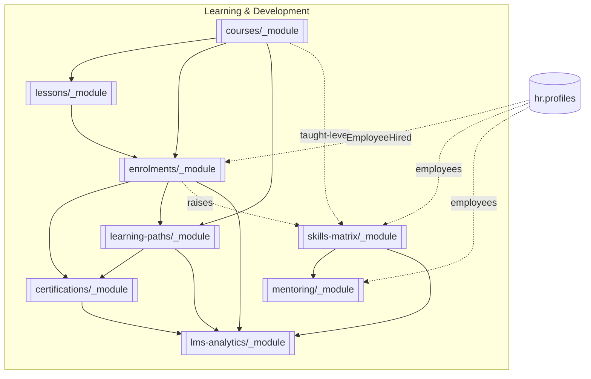

# Learning & Development (LMS)

Courses, lessons, enrolments, certifications, learning paths, skills matrix, mentoring, and analytics. **Panel:** `/lms` (Green) — Phase 3. **Admin side** in Filament; **learner-facing portal** in Vue + Inertia ([[../../frontend/_index|frontend]], ui-strategy row #15).

**Displaces**: TalentLMS, Docebo, 360Learning, Cornerstone OnDemand, SAP SuccessFactors Learning.

Every module is exploded to a folder (`<slug>/_module.md` + architecture / data-model / api / security / decisions / unknowns / `features/`). No flat module files remain.

---

## Modules

| Module | Key | Priority | Tables | Depends on (intra-domain) | Kind highlights |
|---|---|---|---|---|---|
| [[courses/_module\|Course Builder]] | `lms.courses` | p3 | 2 | — (anchor) | resource + #3 page |
| [[lessons/_module\|Lessons & Content]] | `lms.lessons` | p3 | 3 | courses | resource + #3 page |
| [[enrolments/_module\|Enrolments]] | `lms.enrolments` | p3 | 2 | courses, lessons | resource |
| [[certifications/_module\|Certifications]] | `lms.certifications` | p3 | 2 | enrolments | 2 resources |
| [[learning-paths/_module\|Learning Paths]] | `lms.paths` | p3 | 3 | courses, enrolments | resource |
| [[skills-matrix/_module\|Skills Matrix]] | `lms.skills` | p3 | 4 | hr.profiles (courses soft) | resource + #18 page |
| [[mentoring/_module\|Mentoring]] | `lms.mentoring` | p3 | 3 | hr.profiles (skills soft) | resource + #17 page |
| [[lms-analytics/_module\|LMS Analytics]] | `lms.analytics` | p3 | 0 (read-only) | enrolments | #6 page |

---

## Map of Content



Solid = hard intra-domain dependency; dotted = soft / cross-domain read/event.

---

## Cross-Domain Edges

| Direction | Event / API | Counterpart | In module |
|---|---|---|---|
| Consumes | `EmployeeHired` | hr.profiles | enrolments (auto-enrol mandatory) |
| Reads | employees + reporting line | hr.profiles | skills, mentoring |
| Reads (by) | skill context | hr.performance | skills (read-only display) |

**No LMS module writes another domain's tables.** Completion side effects (certificate, skill raise, path advance) are **same-domain direct service calls** from `EnrolmentService` — the v1 `CourseCompleted` / `CertificationExpiring` events were dropped. HR integration on completion (feeding training/performance records) is the domain's biggest open cross-domain question — see each module's `unknowns`. Data-ownership rule: [[../../security/data-ownership]].

---

## UI Kinds by Feature

| Kind | Features |
|---|---|
| simple-resource | course-management, lesson-content, enrolment-management, certificate-issuance, path-builder, skill-catalogue, mentorship-management, session-logging |
| custom-page | course-builder, quizzes, skills-heatmap, gap-analysis, mentor-directory |
| public-vue | learner-portal, public-verification |
| widget | lms-dashboard, compliance-report |
| background | auto-enrol-on-hire, path-progression, expiry-renewal |

---

## Status Board (Dataview)

```dataview
TABLE module AS "Module", build-status AS "Build", status AS "Status"
FROM "domains/lms"
WHERE type = "module"
SORT module ASC
```

---

## Key Patterns

- `awcodes/filament-tiptap-editor` — lesson content (purified).
- `spatie/laravel-pdf` — certificates (queued).
- `spatie/laravel-sluggable` — course slugs (per-company unique).
- `spatie/laravel-model-states` — enrolment state machine.
- Learner portal scope: learner sees own data only (token + user paths) — the domain's key isolation test.
- Quizzes graded server-side; correct answers never serialized to client.
- Mentoring session notes pair-private (query-level, not just UI).

## Related

- [[_opportunities|LMS Opportunity Radar]] · [[../../architecture/cross-domain-relations]]
- [[../../decisions/decision-2026-06-20-full-mapping-conventions]] · [[../../security/data-ownership]]
