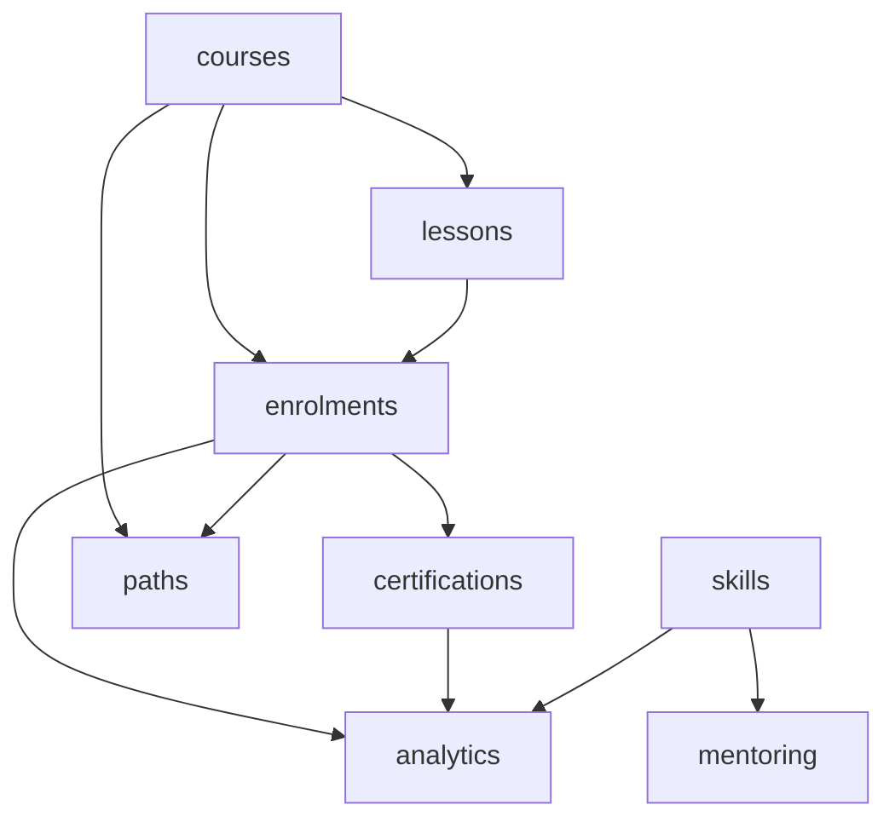

# Learning & Development

Courses, lessons, enrolments, certifications, learning paths, skills matrix, mentoring, and analytics. **Panel:** `/lms` (Green) — Phase 3.

**Admin side** in Filament. **Learner-facing portal** in Vue + Inertia ([[frontend/_index]], ui-strategy row #15).

---

## Navigation Groups

- **Courses** — Courses, Course Builder, Learning Paths
- **Enrolments** — Enrolments, Compliance
- **Certifications** — Certificates, Templates
- **Skills** — Skills Matrix
- **Mentoring** — Mentorships, Mentor Directory
- **Analytics** — LMS Dashboard

---

## Modules

| Module | Key | Status | Priority | Depends on (intra-domain) |
|---|---|---|---|---|
| [[domains/lms/courses\|Course Builder]] | `lms.courses` | planned | p3 | — (anchor) |
| [[domains/lms/lessons\|Lessons & Content]] | `lms.lessons` | planned | p3 | courses |
| [[domains/lms/enrolments\|Enrolments]] | `lms.enrolments` | planned | p3 | courses, lessons |
| [[domains/lms/certifications\|Certifications]] | `lms.certifications` | planned | p3 | enrolments |
| [[domains/lms/learning-paths\|Learning Paths]] | `lms.paths` | planned | p3 | courses, enrolments |
| [[domains/lms/skills-matrix\|Skills Matrix]] | `lms.skills` | planned | p3 | — (courses soft) |
| [[domains/lms/mentoring\|Mentoring]] | `lms.mentoring` | planned | p3 | — (skills soft) |
| [[domains/lms/lms-analytics\|LMS Analytics]] | `lms.analytics` | planned | p3 | enrolments |

## Dependency Graph (intra-domain)



## Cross-Domain Edges

| Direction | Event | Counterpart |
|---|---|---|
| Consumes | `EmployeeHired` (hr.profiles) | lms.enrolments mandatory auto-enrol |

The v1-spec `CourseCompleted`/`CertificationExpiring` events were dropped in v2 — completion side effects (certificate issue, skill raise, path advance) are same-domain direct calls from `EnrolmentService`.

---

## Status Board (Dataview)

```dataview
TABLE module-key AS "Key", status AS "Status", priority AS "Priority"
FROM "domains/lms"
WHERE type = "module"
SORT module-key ASC
```

---

## Key Patterns

- `awcodes/filament-tiptap-editor` — lesson content (purified)
- `spatie/laravel-pdf` — certificates
- `spatie/laravel-sluggable` — course slugs
- Learner portal scope: learner sees own data only (token + user paths) — the domain's key isolation test
- Quizzes graded server-side; correct answers never serialized to client
