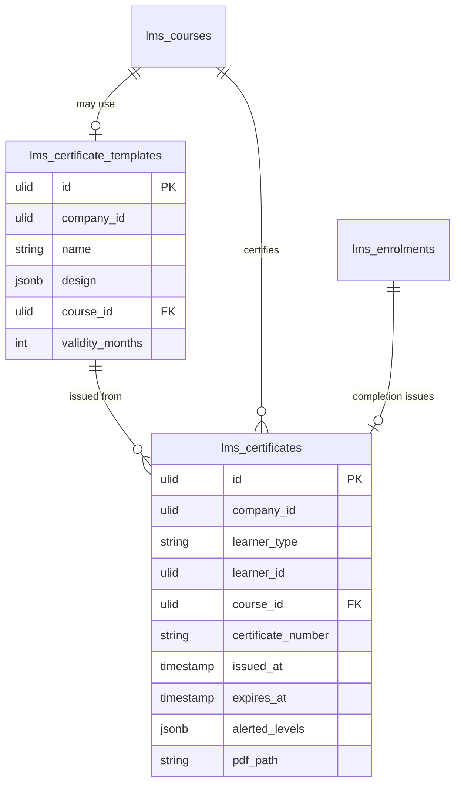

# Certifications — Data Model

## `lms_certificate_templates`

| Column | Type | Notes |
|---|---|---|
| `id` | ulid | PK |
| `company_id` | ulid | Indexed |
| `name` | string | |
| `design` | jsonb | Logo, text, layout |
| `course_id` | ulid nullable | FK → `lms_courses` (optional association) |
| `validity_months` | int nullable | null = no expiry |

## `lms_certificates`

| Column | Type | Notes |
|---|---|---|
| `id` | ulid | PK |
| `company_id` | ulid | Indexed |
| `learner_type` | string | employee / external |
| `learner_id` | ulid | |
| `course_id` | ulid | FK → `lms_courses` |
| `certificate_number` | string | Globally unique `FF-{ulid26}` *(assumed)* |
| `issued_at` | timestamp | |
| `expires_at` | timestamp nullable | From template validity |
| `alerted_levels` | jsonb | 60/14 reminder guards (default `[]`) |
| `pdf_path` | string nullable | Generated PDF |

## ERD

`lms_courses` / `lms_enrolments` owned by sibling modules — shown for context.
