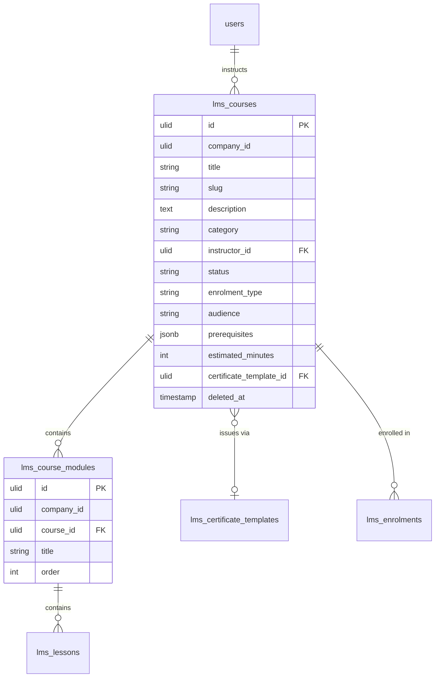

# Courses — Data Model

## `lms_courses`

| Column | Type | Notes |
|---|---|---|
| `id` | ulid | PK |
| `company_id` | ulid | Indexed, `BelongsToCompany` |
| `title` | string | |
| `slug` | string | Unique per company (`spatie/laravel-sluggable`) |
| `description` | text | Purified |
| `category` | string nullable | |
| `instructor_id` | ulid nullable | FK → `users` |
| `status` | string | draft / published / archived (default `draft`) |
| `enrolment_type` | string | open / invite / mandatory |
| `audience` | string | internal / external / both *(assumed)* (default `internal`) |
| `prerequisites` | jsonb | Course ids, cycle-checked (default `[]`) |
| `estimated_minutes` | int nullable | |
| `certificate_template_id` | ulid nullable | FK → `lms_certificate_templates` |
| `created_at` / `updated_at` | timestamps | |
| `deleted_at` | timestamp nullable | `SoftDeletes` |

**Indexes:** `(company_id, status)`, unique `(company_id, slug)`.

## `lms_course_modules`

| Column | Type | Notes |
|---|---|---|
| `id` | ulid | PK |
| `company_id` | ulid | Indexed |
| `course_id` | ulid | FK → `lms_courses` |
| `title` | string | |
| `order` | int | Drag-drop ordering |

## ERD

`lms_lessons`, `lms_enrolments`, `lms_certificate_templates` are owned by sibling modules — shown for context only.
