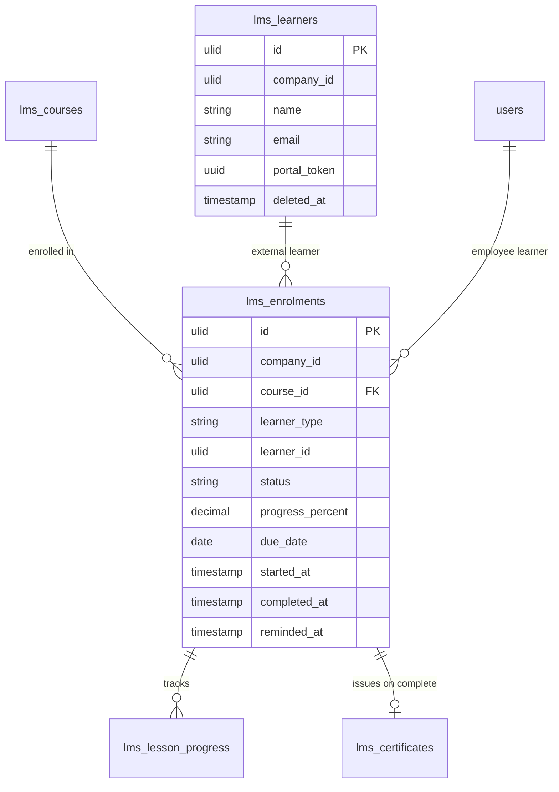

# Enrolments — Data Model

## `lms_enrolments`

| Column | Type | Notes |
|---|---|---|
| `id` | ulid | PK |
| `company_id` | ulid | Indexed |
| `course_id` | ulid | FK → `lms_courses` |
| `learner_type` | string | employee / external |
| `learner_id` | ulid | User id or `lms_learners` id |
| `status` | string | State machine (default `enrolled`) |
| `progress_percent` | decimal(5,2) | Default 0 |
| `due_date` | date nullable | Mandatory courses |
| `started_at` | timestamp nullable | |
| `completed_at` | timestamp nullable | |
| `reminded_at` | timestamp nullable | Due-reminder guard |

**Unique:** active `(course_id, learner_type, learner_id)` (re-enrolment after drop/complete allowed).

## `lms_learners`

| Column | Type | Notes |
|---|---|---|
| `id` | ulid | PK |
| `company_id` | ulid | Indexed |
| `name` | string | |
| `email` | string | Unique per company |
| `portal_token` | uuid | Scoped-guard credential, rotatable |
| `deleted_at` | timestamp nullable | `SoftDeletes` |

## ERD

`lms_courses`, `lms_lesson_progress`, `lms_certificates` owned by sibling modules — shown for context. `learner_id` is a polymorphic ref (employee `users` or external `lms_learners`).
