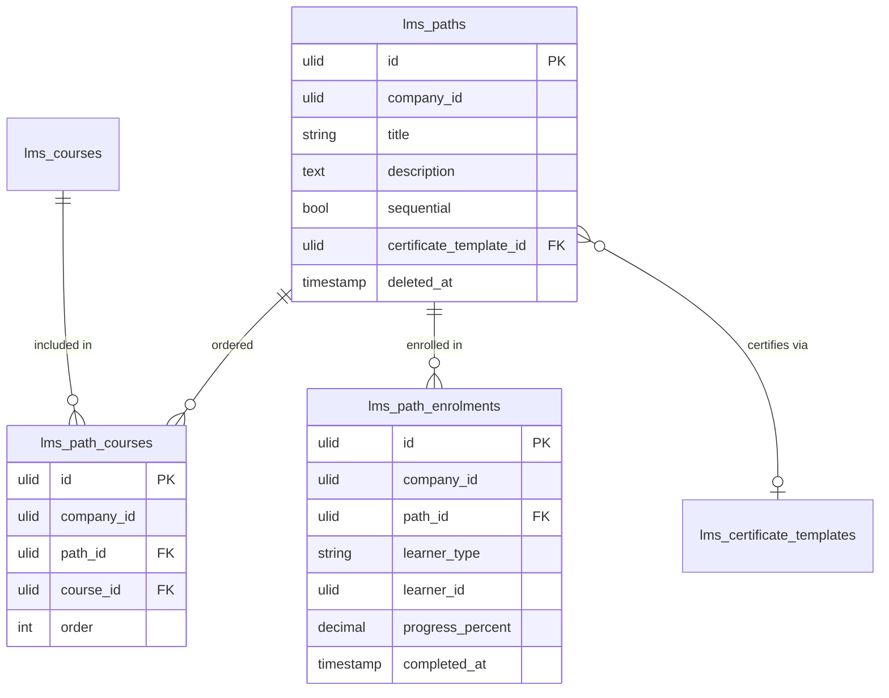

# Learning Paths — Data Model

## `lms_paths`

| Column | Type | Notes |
|---|---|---|
| `id` | ulid | PK |
| `company_id` | ulid | Indexed |
| `title` | string | |
| `description` | text | |
| `sequential` | bool | Sequential unlock vs parallel |
| `certificate_template_id` | ulid nullable | Path-completion certificate |
| `deleted_at` | timestamp nullable | `SoftDeletes` |

## `lms_path_courses`

| Column | Type | Notes |
|---|---|---|
| `id` | ulid | PK |
| `company_id` | ulid | Indexed |
| `path_id` | ulid | FK → `lms_paths` |
| `course_id` | ulid | FK → `lms_courses` |
| `order` | int | Sequence position |

**Unique:** `(path_id, course_id)`.

## `lms_path_enrolments`

| Column | Type | Notes |
|---|---|---|
| `id` | ulid | PK |
| `company_id` | ulid | Indexed |
| `path_id` | ulid | FK → `lms_paths` |
| `learner_type` / `learner_id` | string / ulid | employee / external |
| `progress_percent` | decimal(5,2) | Courses completed / total |
| `completed_at` | timestamp nullable | |

**Unique:** active `(path_id, learner_type, learner_id)`.

## ERD

`lms_courses` / `lms_certificate_templates` owned by sibling modules — shown for context.
