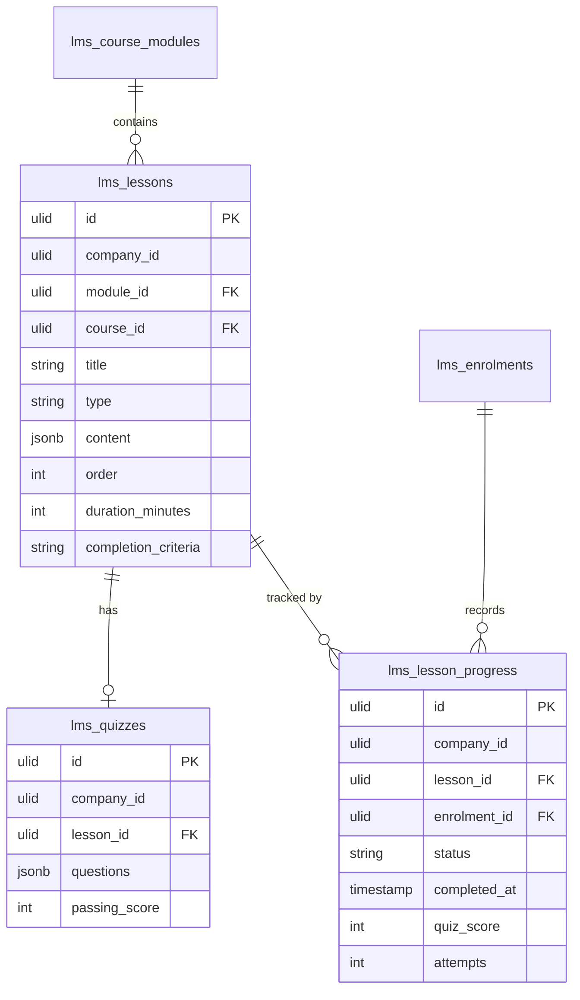

# Lessons — Data Model

## `lms_lessons`

| Column | Type | Notes |
|---|---|---|
| `id` | ulid | PK |
| `company_id` | ulid | Indexed |
| `module_id` | ulid | FK → `lms_course_modules` |
| `course_id` | ulid | FK → `lms_courses` (denormalised for scoping) |
| `title` | string | |
| `type` | string | video / text / file / quiz |
| `content` | jsonb | Per-type shape (see [[architecture]]) |
| `order` | int | Within module |
| `duration_minutes` | int nullable | |
| `completion_criteria` | string | viewed / quiz-passed |

## `lms_quizzes`

| Column | Type | Notes |
|---|---|---|
| `id` | ulid | PK |
| `company_id` | ulid | Indexed |
| `lesson_id` | ulid | FK → `lms_lessons` |
| `questions` | jsonb | `[{question, type, options[], correct}]` — `correct` never serialized to learner |
| `passing_score` | int | 0–100 |

## `lms_lesson_progress`

| Column | Type | Notes |
|---|---|---|
| `id` | ulid | PK |
| `company_id` | ulid | Indexed |
| `lesson_id` | ulid | FK → `lms_lessons` |
| `enrolment_id` | ulid | FK → `lms_enrolments` |
| `status` | string | not-started / in-progress / completed (default `not-started`) |
| `completed_at` | timestamp nullable | |
| `quiz_score` | int nullable | Best score |
| `attempts` | int | Default 0 |

**Unique:** `(lesson_id, enrolment_id)`.

## ERD

`lms_course_modules` (courses) and `lms_enrolments` (enrolments) are owned by sibling modules — shown for context.
