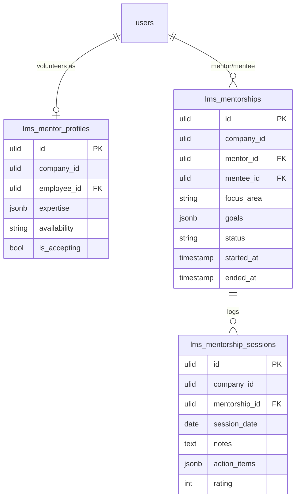

# Mentoring — Data Model

## `lms_mentor_profiles`

| Column | Type | Notes |
|---|---|---|
| `id` | ulid | PK |
| `company_id` | ulid | Indexed |
| `employee_id` | ulid | FK → employee (`users`), unique |
| `expertise` | jsonb | Tags (skills-fed or manual) |
| `availability` | string | Free text |
| `is_accepting` | bool | Open to new mentees |

## `lms_mentorships`

| Column | Type | Notes |
|---|---|---|
| `id` | ulid | PK |
| `company_id` | ulid | Indexed |
| `mentor_id` | ulid | FK → employee |
| `mentee_id` | ulid | FK → employee (≠ mentor) |
| `focus_area` | string | |
| `goals` | jsonb | `[{title, done}]` |
| `status` | string | active / paused / completed |
| `started_at` | timestamp | |
| `ended_at` | timestamp nullable | |

**Unique:** active `(mentor_id, mentee_id)`.

## `lms_mentorship_sessions`

| Column | Type | Notes |
|---|---|---|
| `id` | ulid | PK |
| `company_id` | ulid | Indexed |
| `mentorship_id` | ulid | FK → `lms_mentorships` |
| `session_date` | date | ≤ today |
| `notes` | text | **Pair-only** visibility |
| `action_items` | jsonb | |
| `rating` | int nullable | Optional session feedback |

## ERD

`users`/employee owned by HR — shown for context.
