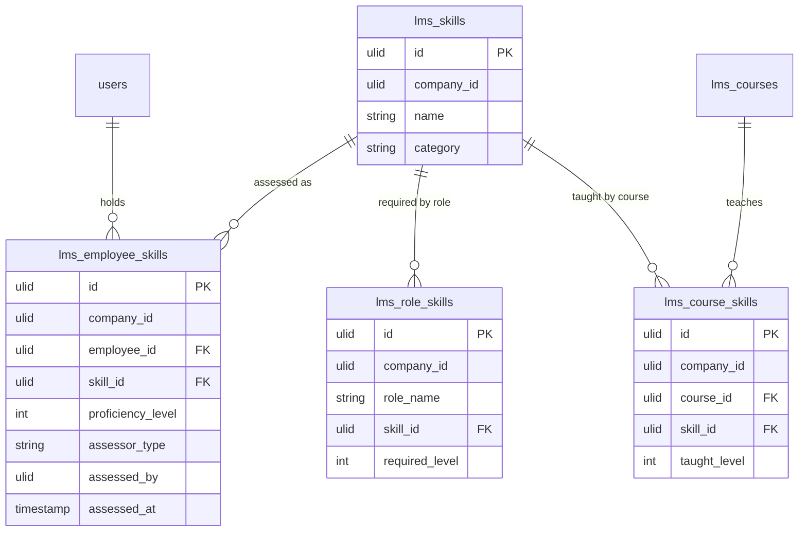

# Skills Matrix — Data Model

## `lms_skills`

| Column | Type | Notes |
|---|---|---|
| `id` | ulid | PK |
| `company_id` | ulid | Indexed |
| `name` | string | Unique per company |
| `category` | string | technical / soft / compliance |

## `lms_employee_skills`

| Column | Type | Notes |
|---|---|---|
| `id` | ulid | PK |
| `company_id` | ulid | Indexed |
| `employee_id` | ulid | FK → hr employee (`users`) |
| `skill_id` | ulid | FK → `lms_skills` |
| `proficiency_level` | int | 0–3 enum |
| `assessor_type` | string | self / manager |
| `assessed_by` | ulid | User id of the assessor |
| `assessed_at` | timestamp | |

**Unique:** `(employee_id, skill_id, assessor_type)` *(assumed: one row per assessor type)*.

## `lms_role_skills`

| Column | Type | Notes |
|---|---|---|
| `id` | ulid | PK |
| `company_id` | ulid | Indexed |
| `role_name` | string | Role/position |
| `skill_id` | ulid | FK → `lms_skills` |
| `required_level` | int | 0–3 |

**Unique:** `(role_name, skill_id)`.

## `lms_course_skills`

| Column | Type | Notes |
|---|---|---|
| `id` | ulid | PK |
| `company_id` | ulid | Indexed |
| `course_id` | ulid | FK → `lms_courses` |
| `skill_id` | ulid | FK → `lms_skills` |
| `taught_level` | int | Level a completion confers |

## ERD

`lms_courses` owned by courses; `users`/employee owned by HR — shown for context.
