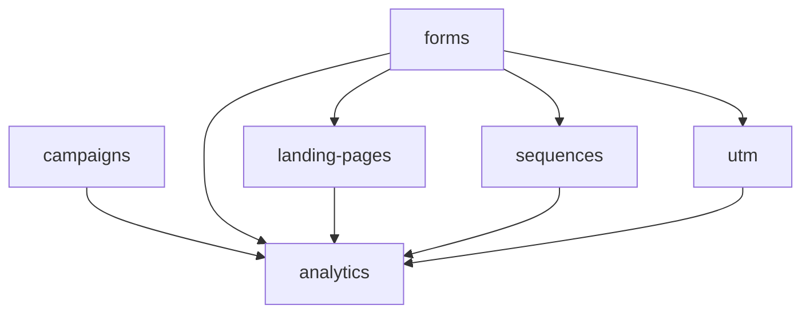

# Marketing

Email campaigns, drip sequences, forms, landing pages, content CMS, and attribution analytics. **Panel:** `/marketing` (Pink) — Phase 3.

**Displaces**: Mailchimp, ActiveCampaign, Brevo, HubSpot Marketing

---

## Navigation Groups

- **Campaigns** — Campaigns, Email Sequences
- **Capture** — Forms, Landing Pages
- **Content** — Blog Posts, Categories
- **Analytics** — Marketing Dashboard, UTM Builder

---

## Modules

| Module | Key | Status | Priority | Depends on (intra-domain) |
|---|---|---|---|---|
| [[domains/marketing/campaigns\|Campaigns]] | `marketing.campaigns` | planned | p3 | — (anchor) |
| [[domains/marketing/forms\|Forms]] | `marketing.forms` | planned | p3 | — |
| [[domains/marketing/email-sequences\|Email Sequences]] | `marketing.sequences` | planned | p3 | forms (soft) |
| [[domains/marketing/landing-pages\|Landing Pages]] | `marketing.landing-pages` | planned | p3 | forms (soft) |
| [[domains/marketing/content-cms\|Content CMS]] | `marketing.cms` | planned | p3 | — |
| [[domains/marketing/utm-tracking\|UTM Tracking]] | `marketing.utm` | planned | p3 | forms (soft) |
| [[domains/marketing/marketing-analytics\|Marketing Analytics]] | `marketing.analytics` | planned | p3 | campaigns |

## Dependency Graph (intra-domain)



## Cross-Domain Edges

| Direction | Event | Counterpart |
|---|---|---|
| Fires | `FormSubmissionReceived` (forms) | crm.contacts find-or-create; marketing.sequences enrol; marketing.utm touches |
| Consumes | `TicketResolved` CSAT (P3 design) | superseded — support.analytics owns CSAT v1 |

Suppression list (`mkt_unsubscribes`) honored by campaigns AND sequences.

---

## Status Board (Dataview)

```dataview
TABLE module-key AS "Key", status AS "Status", priority AS "Priority"
FROM "domains/marketing"
WHERE type = "module"
SORT module-key ASC
```

---

## Key Patterns

- Batched queue sends (campaigns, sequences) — [[architecture/queue-jobs]]
- `spatie/laravel-sluggable` — landing pages, blog posts, forms
- `awcodes/filament-tiptap-editor` — campaign + post content (purified)
- Public surfaces (forms, landing pages, blog, unsubscribe) = Vue + Inertia, rate-limited
- Audiences from [[domains/crm/customer-segments]]
