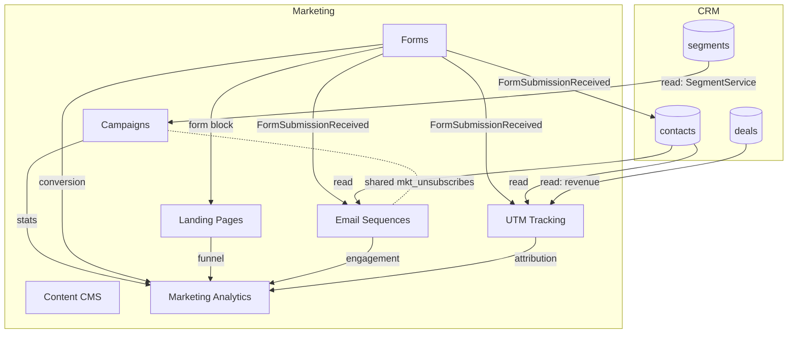

# Marketing — Map of Content

Email campaigns, drip sequences, forms, landing pages, content CMS, and attribution analytics. **Panel:** `/marketing` (Pink) — Phase 3. **Displaces** Mailchimp, ActiveCampaign, Brevo, HubSpot Marketing.

Every module is exploded to a folder (`_module` + architecture · data-model+ERD · api · security · decisions · unknowns · `features/`). Full-mapping constitution: [[../../decisions/decision-2026-06-20-full-mapping-conventions]]. Differentiators: [[_opportunities]].

## Modules

| Module | Key | Priority | Tables (owns) | Features | Kind highlights |
|---|---|---|---|---|---|
| [[campaigns/_module\|Campaigns]] | `marketing.campaigns` | p3 | `mkt_campaigns`, `mkt_campaign_recipients`, `mkt_unsubscribes` | compose-schedule · audience-materialisation · ab-testing · tracking-suppression | resource |
| [[forms/_module\|Forms]] | `marketing.forms` | p3 | `mkt_forms`, `mkt_form_submissions` | form-builder · embed-hosted · public-submit | 2 resources |
| [[email-sequences/_module\|Email Sequences]] | `marketing.sequences` | p3 | `mkt_sequences`, `mkt_sequence_steps`, `mkt_sequence_enrolments` | build-sequence · enrolment-triggers · advancement-engine | 2 resources |
| [[landing-pages/_module\|Landing Pages]] | `marketing.landing-pages` | p3 | `mkt_landing_pages` | page-builder · publish-render · page-analytics | resource |
| [[content-cms/_module\|Content CMS]] | `marketing.cms` | p3 | `mkt_posts`, `mkt_post_categories` | authoring · scheduling-publish · public-blog | 2 resources |
| [[utm-tracking/_module\|UTM Tracking]] | `marketing.utm` | p3 | `mkt_utm_touches` | touch-capture · utm-builder · attribution | resource + #7 page |
| [[marketing-analytics/_module\|Marketing Analytics]] | `marketing.analytics` | p3 | *(none — read-only)* | marketing-dashboard | #6 page |

## Navigation Groups

- **Campaigns** — Campaigns, Email Sequences
- **Capture** — Forms, Landing Pages
- **Content** — Blog Posts, Categories
- **Analytics** — Marketing Dashboard, UTM Builder

## Dependency & Data-Flow Graph



## Cross-Domain Edges (summary)

| Direction | Event / API | Counterpart |
|---|---|---|
| Fires | `FormSubmissionReceived` (forms) | crm.contacts (find-or-create) · marketing.sequences (enrol) · marketing.utm (touch) |
| Reads | `SegmentService::contacts()` | crm.segments (campaigns audience, read-only) |
| Reads | contact + deal joins | crm.contacts / crm.deals (utm attribution, read-only) |

**Data ownership:** each `mkt_*` table has exactly one writing module (table column above). Marketing **reads** CRM via services and **fires events**; it never writes CRM tables. Full rule: [[../../security/data-ownership]].

## Status Board (Dataview)

```dataview
TABLE module AS "Module", status AS "Status", build-status AS "Build"
FROM "domains/marketing"
WHERE type = "module"
SORT module ASC
```

## Key Patterns

- Batched queue sends (campaigns, sequences) — [[../../architecture/queue-jobs]]
- `spatie/laravel-sluggable` — landing pages, blog posts, forms
- `awcodes/filament-tiptap-editor` — campaign + post content (purified)
- Public surfaces (forms, landing pages, blog, unsubscribe) = Vue + Inertia, rate-limited
- Audiences from [[../crm/customer-segments/_module|crm.segments]]; shared suppression list across campaigns + sequences

## Related

- [[_opportunities|Marketing Opportunities]] · [[../_overview]] · [[../../security/data-ownership]] · [[../../architecture/patterns/feature-ui-spec]]
