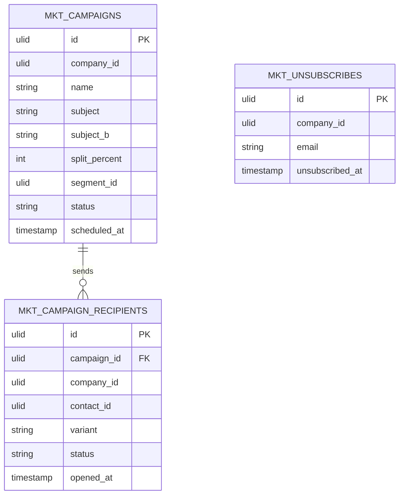

# Campaigns — Data Model

Owns three tables. All company-scoped (`company_id` indexed). Recipients reference CRM `contact_id` but the row lives in the campaigns snapshot — CRM tables are never written.

### mkt_campaigns

| Column | Type | Notes |
|---|---|---|
| id, company_id (indexed) | ulid | |
| name / subject | string | + subject_b nullable, split_percent int (A/B) |
| from_name / from_email | string | |
| segment_id | ulid nullable | or manual list |
| content | text | purified |
| status | string default `draft` | state machine |
| scheduled_at / sent_at | timestamp nullable | |
| deleted_at | timestamp nullable | |

### mkt_campaign_recipients

| Column | Type | Notes |
|---|---|---|
| id, campaign_id FK, company_id (indexed), contact_id FK | ulid | unique `(campaign_id, contact_id)` |
| variant | string nullable | a / b |
| status | string default `pending` | pending / sent / delivered / failed |
| opened_at / clicked_at / bounced_at / unsubscribed_at | timestamp nullable | |

### mkt_unsubscribes

| Column | Type | Notes |
|---|---|---|
| id, company_id (indexed) | ulid | |
| email | string | unique per company |
| unsubscribed_at | timestamp | |

Shared suppression list — read + written by campaigns AND [[../email-sequences/_module|sequences]] (both marketing-domain modules; still one write owner: whichever marketing module records the unsubscribe).

## ERD

## Related

- [[_module]] · [[architecture]] · [[security]]
