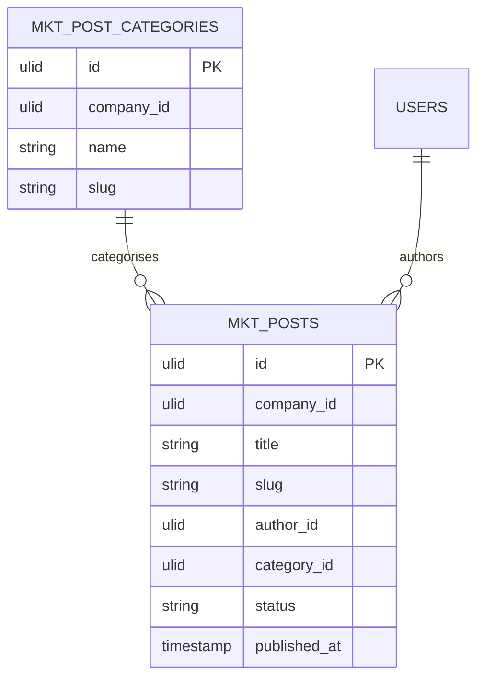

# Content CMS — Data Model

Owns two tables, company-scoped. `author_id` references core users (read-only display).

### mkt_posts

| Column | Type | Notes |
|---|---|---|
| id, company_id (indexed) | ulid | |
| title | string | |
| slug | string | sluggable, unique per company |
| body | text | purified |
| excerpt | text nullable | |
| featured_image | string nullable | media path |
| author_id | ulid FK users | read-only display |
| category_id | ulid nullable FK | |
| status | string default `draft` | draft / scheduled / published |
| published_at | timestamp nullable | schedule + display date |
| meta_title / meta_description / og_image | string nullable | SEO |
| deleted_at | timestamp nullable | |

### mkt_post_categories

| Column | Type | Notes |
|---|---|---|
| id, company_id (indexed) | ulid | |
| name | string | |
| slug | string | unique per company |

Tags via `spatie/laravel-tags` (polymorphic, shared). Search index = Meilisearch projection of published posts (owned).

## ERD

## Related

- [[_module]] · [[architecture]] · [[../../../architecture/search]]
