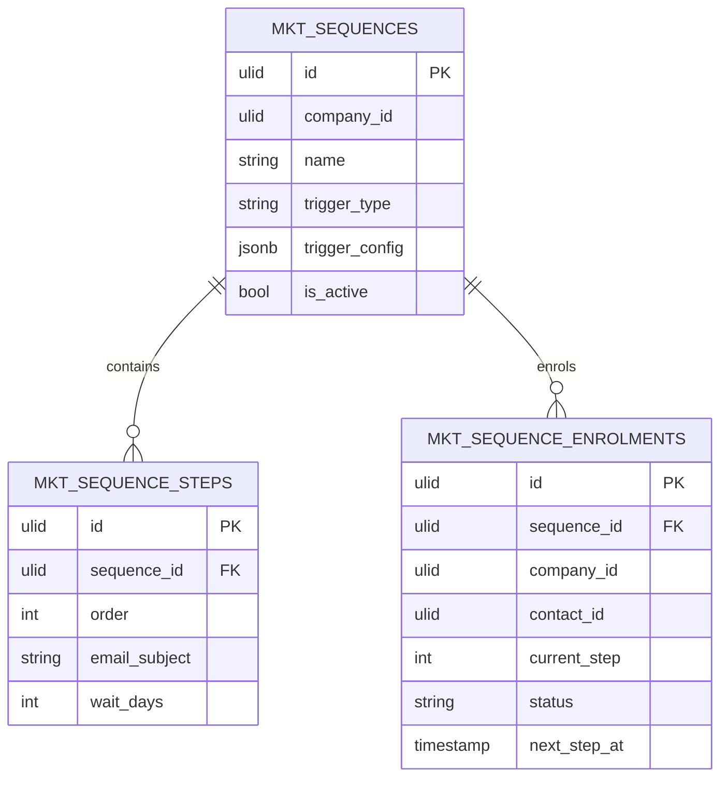

# Email Sequences — Data Model

Owns three tables, all company-scoped. Reuses campaign open/click tracking machinery per send.

### mkt_sequences

| Column | Type | Notes |
|---|---|---|
| id, company_id (indexed) | ulid | |
| name | string | |
| trigger_type | string | form / segment / contact-created / manual |
| trigger_config | jsonb | validated per type |
| is_active | boolean | pause flag |
| deleted_at | timestamp nullable | |

### mkt_sequence_steps

| Column | Type | Notes |
|---|---|---|
| id, sequence_id FK, company_id | ulid | |
| order | int | unique per sequence |
| email_subject | string | |
| email_body | text | purified |
| wait_days | int | delay before next step |

### mkt_sequence_enrolments

| Column | Type | Notes |
|---|---|---|
| id, sequence_id FK, company_id (indexed), contact_id FK | ulid | unique active `(sequence_id, contact_id)` |
| current_step | int default 0 | |
| status | string default `active` | active / paused / completed / exited |
| next_step_at | timestamp | advancement cursor |
| enrolled_at / completed_at | timestamp | |

**Indexes:** `(company_id, status, next_step_at)` — the advancement sweep predicate.

## ERD

## Related

- [[_module]] · [[architecture]] · [[../campaigns/data-model]] (shared `mkt_unsubscribes`)
