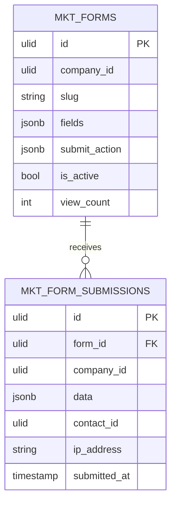

# Forms — Data Model

Owns two tables, company-scoped. `contact_id` on a submission is a read-reference to CRM (nullable; set by CRM's listener result, mirrored back read-only *(assumed)*) — CRM tables are never written by forms.

### mkt_forms

| Column | Type | Notes |
|---|---|---|
| id, company_id (indexed) | ulid | |
| name | string | |
| slug | string unique | hosted URL + embed key |
| fields | jsonb | `[{key, type, label, required, options?}]` — exactly one email field |
| submit_action | jsonb | `{enrol_sequence_id?, notify_user_ids?}` |
| redirect_url / thank_you_message | string / text nullable | |
| is_active | boolean | |
| view_count | int default 0 | conversion base |
| deleted_at | timestamp nullable | |

### mkt_form_submissions

| Column | Type | Notes |
|---|---|---|
| id, company_id (indexed), form_id FK | ulid | |
| data | jsonb | submitted values |
| contact_id | ulid nullable | CRM contact ref (read-only) |
| ip_address | string | |
| submitted_at | timestamp | |

## ERD

## Related

- [[_module]] · [[architecture]] · [[security]]
