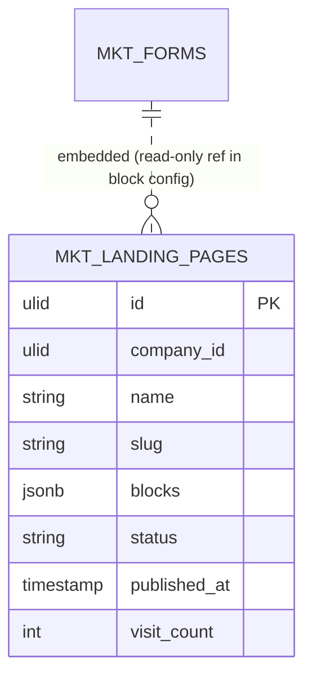

# Landing Pages — Data Model

Owns one table. Block content is a typed JSON array validated against `BlockRegistry`.

### mkt_landing_pages

| Column | Type | Notes |
|---|---|---|
| id, company_id (indexed) | ulid | |
| name | string | |
| slug | string | sluggable, unique per company |
| blocks | jsonb | `[{type, config}]` — types in registry |
| meta_title / meta_description / og_image | string nullable | SEO |
| status | string default `draft` | draft / published |
| published_at | timestamp nullable | |
| visit_count | int default 0 | |
| deleted_at | timestamp nullable | |

## ERD

Form-block config holds a `form_id` reference read from [[../forms/_module|Forms]] — no FK write into forms.

## Related

- [[_module]] · [[architecture]] · [[security]]
