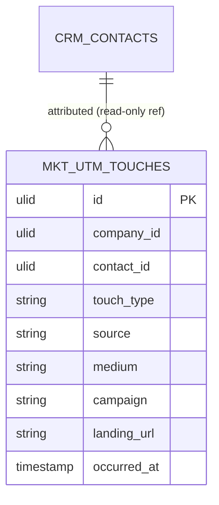

# UTM Tracking — Data Model

Owns one table. `contact_id` references CRM (read-only target); touches purge with contact erasure.

### mkt_utm_touches

| Column | Type | Notes |
|---|---|---|
| id, company_id (indexed), contact_id FK | ulid | |
| touch_type | string | first / last — first immutable, last upserted |
| source / medium / campaign / term / content | string nullable | UTM params |
| landing_url | string | |
| occurred_at | timestamp | |

**Unique** `(contact_id, touch_type)` — at most one first + one last per contact.

## ERD

Attribution joins touches → CRM contacts → CRM deals (read-only) for revenue by channel.

## Related

- [[_module]] · [[architecture]] · [[security]]
