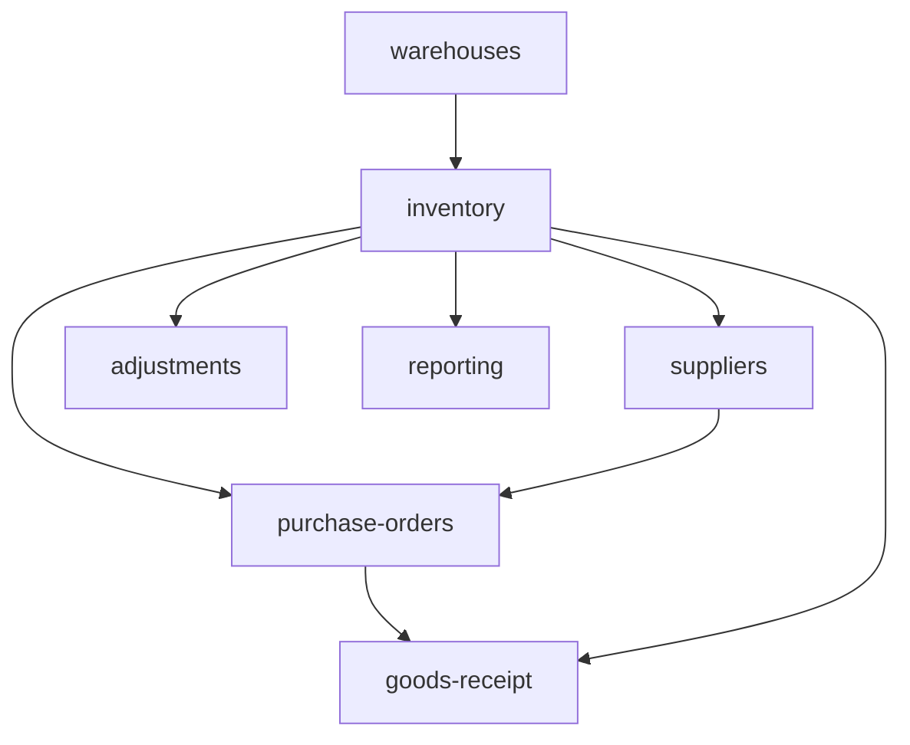

# Operations

Inventory, purchase orders, warehouses, suppliers, goods receipt, and stock adjustments. **Panel:** `/operations` (Orange) — Phase 3.

**This panel also hosts the Procurement domain** (see [[build/decisions/decision-2026-06-01-panel-consolidation]]). Procurement and Operations share the PO/GRN/supplier entities, so they run in one panel.

---

## Navigation Groups

- **Inventory** — Items, Stock Movements, Warehouses, Transfers, Adjustments
- **Purchasing** — Purchase Orders, Suppliers, Goods Receipt
- **Reporting** — Operations Dashboard, Spend Analytics
- **Procurement** (Procurement domain) — Requisitions, Sourcing, Supplier Catalogue, Approvals

---

## Modules

| Module | Key | Status | Priority | Depends on (intra-domain) |
|---|---|---|---|---|
| [[domains/operations/warehouses\|Warehouses]] | `operations.warehouses` | planned | p3 | — (build first) |
| [[domains/operations/inventory\|Inventory]] | `operations.inventory` | planned | p3 | warehouses |
| [[domains/operations/suppliers\|Suppliers]] | `operations.suppliers` | planned | p3 | inventory |
| [[domains/operations/purchase-orders\|Purchase Orders]] | `operations.purchase-orders` | planned | p3 | inventory, suppliers |
| [[domains/operations/goods-receipt\|Goods Receipt]] | `operations.goods-receipt` | planned | p3 | purchase-orders, inventory |
| [[domains/operations/stock-adjustments\|Stock Adjustments]] | `operations.adjustments` | planned | p3 | inventory |
| [[domains/operations/operations-reporting\|Operations Reporting]] | `operations.reporting` | planned | p3 | inventory |

## Dependency Graph (intra-domain)



## Cross-Domain Edges

| Direction | Event | Counterpart |
|---|---|---|
| Fires | `GoodsReceived` (goods-receipt) | finance.ap draft bill + 3-way match |

Stock updates stay inside Operations (same-domain direct calls — never via the event). GL write-off posting deferred (report for finance). Payload contract: [[architecture/event-bus]].

---

## Status Board (Dataview)

```dataview
TABLE module-key AS "Key", status AS "Status", priority AS "Priority"
FROM "domains/operations"
WHERE type = "module"
SORT module-key ASC
```

---

## Key Patterns

- `spatie/laravel-model-states` — PO status
- `spatie/laravel-pdf` — PO PDFs
- `StockService::move()` = the only stock write path; levels derived from movements
- Integrates with [[domains/procurement/_index]] (requisitions → POs)
- All quantities decimal(12,2); all money integer cents
