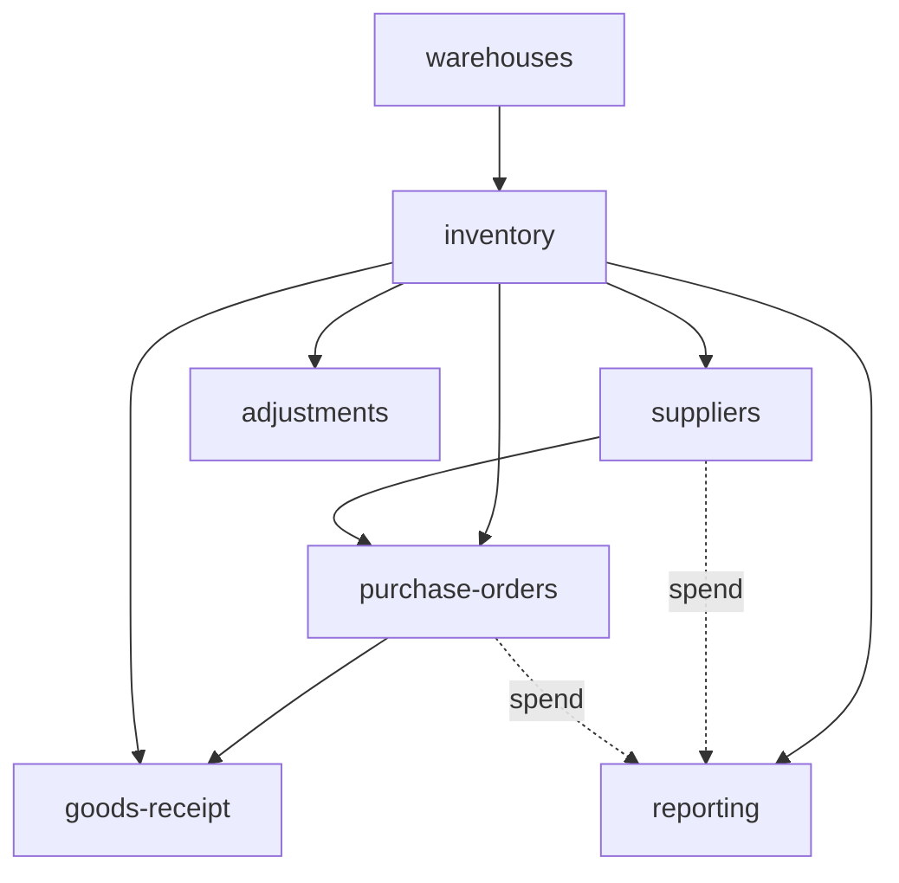

# Operations

Inventory, purchase orders, warehouses, suppliers, goods receipt, and stock adjustments — the physical-goods backbone for SMEs. **Panel:** `/operations` (Orange) — Phase 3.

**This panel also hosts the Procurement domain** (see [[../../decisions/decision-2026-06-01-panel-consolidation]]). Procurement and Operations share the PO/GRN/supplier entities, so they run in one panel.

**Displaces**: NetSuite (inventory), Cin7, inFlow, Katana, Zoho Inventory — the "outgrew spreadsheets, not ready for full ERP" middle. See [[_opportunities]].

> All 7 modules are folder specs (`<slug>/_module.md` + architecture / data-model / api / security / decisions / unknowns / features). Status is uniform `planned`.

---

## Navigation Groups

- **Inventory** — Items, Stock Board, Stock Movements, Warehouses, Transfers, Adjustments, Stocktake
- **Purchasing** — Purchase Orders, Suppliers, Goods Receipt
- **Reporting** — Operations Dashboard, Spend Analytics
- **Procurement** (Procurement domain) — Requisitions, Sourcing, Supplier Catalogue, Approvals

---

## Modules

| Module | Key | Priority | Build status | Depends on (intra-domain) | Owns tables |
|---|---|---|---|---|---|
| [[warehouses/_module\|Warehouses]] | `operations.warehouses` | p3 | planned | — (build first) | `ops_warehouses`, `ops_warehouse_transfers` |
| [[inventory/_module\|Inventory]] | `operations.inventory` | p3 | planned | warehouses | `ops_items`, `ops_stock_levels`, `ops_stock_movements` |
| [[suppliers/_module\|Suppliers]] | `operations.suppliers` | p3 | planned | inventory | `ops_suppliers`, `ops_supplier_items` |
| [[purchase-orders/_module\|Purchase Orders]] | `operations.purchase-orders` | p3 | planned | inventory, suppliers | `ops_purchase_orders`, `ops_po_lines` |
| [[goods-receipt/_module\|Goods Receipt]] | `operations.goods-receipt` | p3 | planned | purchase-orders, inventory | `ops_goods_receipts`, `ops_grn_lines` |
| [[stock-adjustments/_module\|Stock Adjustments]] | `operations.adjustments` | p3 | planned | inventory | `ops_stock_adjustments` |
| [[operations-reporting/_module\|Operations Reporting]] | `operations.reporting` | p3 | planned | inventory | — (read-only) |

Build order: warehouses → inventory → suppliers → purchase-orders → goods-receipt → adjustments → reporting.

## Dependency Graph (intra-domain)



(Dashed = soft/read-only feeds into reporting. Warehouses builds first — inventory's `ops_stock_levels` FKs it. Stock is only ever written by inventory's `StockService`; every other module calls into it.)

## Cross-Domain Edges

| Direction | Event / API | Counterpart | Notes |
|---|---|---|---|
| Fires | `GoodsReceived` (goods-receipt) | finance.ap | draft bill + 3-way match; accepted totals only |
| Reads | procurement requisition | procurement.requisitions | approved requisition → PO |
| Links | `fin_supplier_id` | finance.ap | operational supplier ↔ financial supplier reference |
| Reports | write-off value impact | finance.ledger | **manual** — v1 exports a report; GL auto-posting deferred |

Stock stays inside Operations (same-domain `StockService` calls — never via events). The **only** cross-domain event is `GoodsReceived`, fired by goods-receipt. Payload contracts: [[../../architecture/event-bus]].

**Data-ownership line:** every `ops_*` table is owned + written by exactly one module (see the Owns-tables column). Cross-module stock changes go through inventory's `StockService`; cross-domain effects go through events / read APIs only — no service writes another's tables ([[../../security/data-ownership]]).

---

## Status Board (Dataview)

```dataview
TABLE module AS "Module", build-status AS "Build", status AS "Status"
FROM "domains/operations"
WHERE type = "module"
SORT module ASC
```

---

## Key Patterns

- `StockService::move()` = the single stock write path; levels derived from an append-only movement ledger
- `spatie/laravel-model-states` — PO status; simple flag for adjustment approval
- `spatie/laravel-pdf` — PO PDFs; `maatwebsite/laravel-excel` — report exports
- `spatie/laravel-model-states`, brick/money (integer cents), decimal(12,2) quantities throughout
- Integrates with [[../procurement/_index|Procurement]] (requisitions → POs) in the same panel

## Related

- [[_opportunities|Operations — Market Opportunities]]
- [[../../security/data-ownership]] · [[../../architecture/event-bus]] · [[../../architecture/ui-strategy]]
- [[../../decisions/decision-2026-06-20-full-mapping-conventions]]
