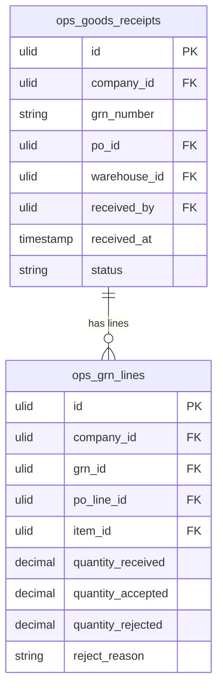

# Goods Receipt — Data Model

## ops_goods_receipts

| Column | Type | Constraints | Notes |
|---|---|---|---|
| id | ulid | PK | |
| company_id | ulid | not null, FK companies, indexed | BelongsToCompany |
| grn_number | string | not null | unique `(company_id, grn_number)` |
| po_id | ulid | not null, FK ops_purchase_orders | |
| warehouse_id | ulid | not null, FK ops_warehouses | receiving location |
| received_by | ulid | not null, FK users | |
| received_at | timestamp | not null | |
| status | string | not null, default `accepted` | accepted / partially-rejected *(assumed simple enum)* |

**Indexes:** `(company_id, grn_number)` unique, `(company_id, po_id)`

---

## ops_grn_lines

| Column | Type | Constraints | Notes |
|---|---|---|---|
| id | ulid | PK | |
| company_id | ulid | not null, indexed | |
| grn_id | ulid | not null, FK ops_goods_receipts | |
| po_line_id | ulid | not null, FK ops_po_lines | |
| item_id | ulid | not null, FK ops_items | |
| quantity_received | decimal(12,2) | not null | = accepted + rejected |
| quantity_accepted | decimal(12,2) | not null | → stock movement `in` |
| quantity_rejected | decimal(12,2) | not null, default 0 | no stock movement |
| reject_reason | string | nullable | required when rejected > 0 |

**Cross-check:** `quantity_received = quantity_accepted + quantity_rejected` per line.

---

## ERD

(`ops_purchase_orders` / `ops_po_lines` owned by [[../purchase-orders/_module|operations.purchase-orders]]; `ops_warehouses` by [[../warehouses/_module|operations.warehouses]]; `ops_items` by [[../inventory/_module|operations.inventory]]. Accepted quantities post `in` movements via `StockService` — never a direct write to inventory tables.)
