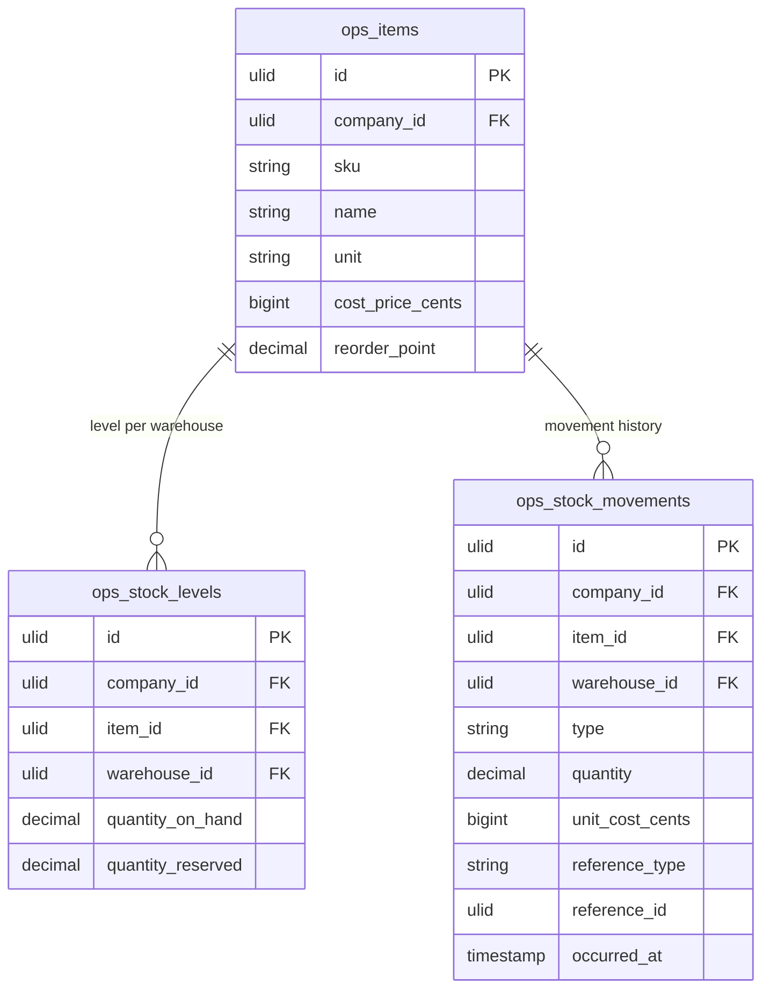

# Inventory — Data Model

## ops_items

| Column | Type | Constraints | Notes |
|---|---|---|---|
| id | ulid | PK | |
| company_id | ulid | not null, FK companies, indexed | BelongsToCompany |
| sku | string | not null | unique `(company_id, sku)` |
| name | string | not null | |
| category | string | nullable | |
| unit | string | not null | piece / kg / m … |
| cost_price_cents | bigint | not null, default 0 | weighted average, updated on receipt |
| reorder_point | decimal(12,2) | not null, default 0 | 0 = no alert |
| deleted_at | timestamp | nullable | blocked while stock > 0 *(assumed)* |

**Indexes:** `(company_id, sku)` unique, `(company_id, category)`

---

## ops_stock_levels

| Column | Type | Constraints | Notes |
|---|---|---|---|
| id | ulid | PK | |
| company_id | ulid | not null, indexed | |
| item_id | ulid | not null, FK ops_items | |
| warehouse_id | ulid | not null, FK ops_warehouses | |
| quantity_on_hand | decimal(12,2) | not null, default 0 | derived from movements |
| quantity_reserved | decimal(12,2) | not null, default 0 | available = on_hand − reserved |

**Indexes:** `(item_id, warehouse_id)` unique. Never edited directly — upserted by `StockService::move`.

---

## ops_stock_movements (append-only ledger)

| Column | Type | Constraints | Notes |
|---|---|---|---|
| id | ulid | PK | |
| company_id | ulid | not null, indexed | |
| item_id | ulid | not null, FK ops_items | |
| warehouse_id | ulid | not null, FK ops_warehouses | |
| type | string | not null | in / out / transfer-in / transfer-out / adjust |
| quantity | decimal(12,2) | not null | signed by type semantics |
| unit_cost_cents | bigint | nullable | receipts (`in`) carry cost |
| reference_type | string | nullable | GRN / transfer / adjustment |
| reference_id | ulid | nullable | polymorphic source id |
| occurred_at | timestamp | not null | |

**Indexes:** `(company_id, item_id, occurred_at)`. Append-only — no update/delete.

---

## ERD

(`ops_warehouses` FK owned by [[../warehouses/_module|operations.warehouses]]. `reference_id` points at rows in other Operations tables — GRN lines, transfers, adjustments — but this module still only *writes* its own three tables.)
