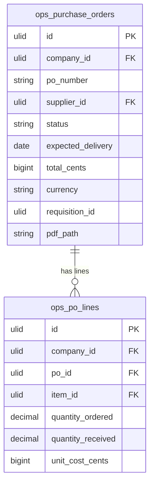

# Purchase Orders — Data Model

## ops_purchase_orders

| Column | Type | Constraints | Notes |
|---|---|---|---|
| id | ulid | PK | |
| company_id | ulid | not null, FK companies, indexed | BelongsToCompany |
| po_number | string | not null | unique `(company_id, po_number)` |
| supplier_id | ulid | not null, FK ops_suppliers | |
| status | string | not null, default `draft` | state machine |
| expected_delivery | date | nullable | |
| total_cents | bigint | not null, default 0 | Σ lines, brick/money |
| currency | string(3) | not null | ISO 4217 |
| requisition_id | ulid | nullable | procurement origin |
| pdf_path | string | nullable | generated on send |
| deleted_at | timestamp | nullable | |

**Indexes:** `(company_id, po_number)` unique, `(company_id, status)`, `(company_id, supplier_id)`

---

## ops_po_lines

| Column | Type | Constraints | Notes |
|---|---|---|---|
| id | ulid | PK | |
| company_id | ulid | not null, indexed | |
| po_id | ulid | not null, FK ops_purchase_orders | |
| item_id | ulid | not null, FK ops_items | |
| quantity_ordered | decimal(12,2) | not null | > 0 |
| quantity_received | decimal(12,2) | not null, default 0 | updated by GRN (same-domain) |
| unit_cost_cents | bigint | not null | defaults from supplier catalogue |

**Indexes:** `(po_id)`

---

## ERD

(`ops_suppliers` owned by [[../suppliers/_module|operations.suppliers]]; `ops_items` by [[../inventory/_module|operations.inventory]]; `requisition_id` references procurement — reference only, no write.)
