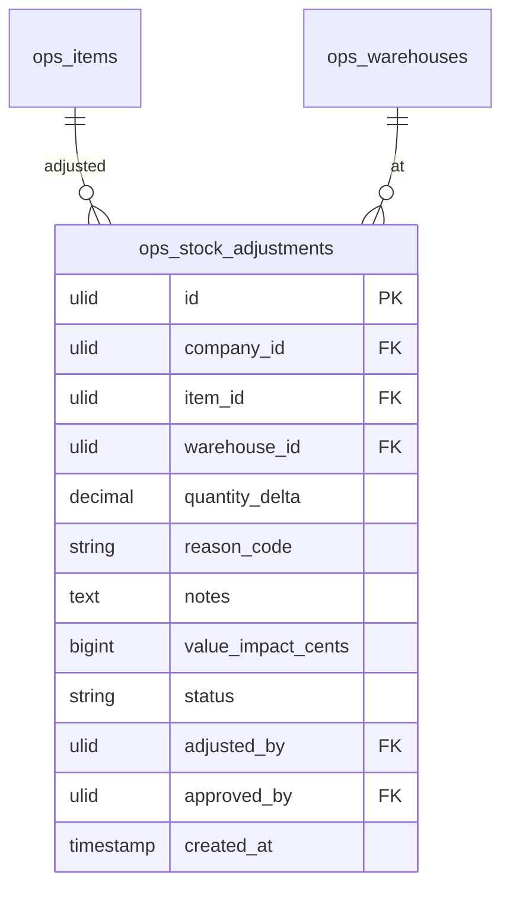

# Stock Adjustments — Data Model

## ops_stock_adjustments

| Column | Type | Constraints | Notes |
|---|---|---|---|
| id | ulid | PK | |
| company_id | ulid | not null, FK companies, indexed | BelongsToCompany |
| item_id | ulid | not null, FK ops_items | |
| warehouse_id | ulid | not null, FK ops_warehouses | |
| quantity_delta | decimal(12,2) | not null | ≠ 0, signed |
| reason_code | string | not null | damage / loss / theft / stocktake / write-off / found |
| notes | text | nullable | required for theft/write-off *(assumed)* |
| value_impact_cents | bigint | not null | delta × item cost at time, brick/money |
| status | string | not null, default `applied` | pending-approval / applied *(assumed)* |
| adjusted_by | ulid | not null, FK users | |
| approved_by | ulid | nullable, FK users | approver ≠ adjuster |
| created_at | timestamp | not null | |

**Indexes:** `(company_id, reason_code)`, `(company_id, status)`, `(company_id, created_at)`

---

## ERD

(`ops_items` owned by [[../inventory/_module|operations.inventory]]; `ops_warehouses` by [[../warehouses/_module|operations.warehouses]]. Applying an adjustment posts an `adjust` movement through `StockService` — the level tables are never written here. Stocktake produces one `ops_stock_adjustments` row per non-zero delta.)
