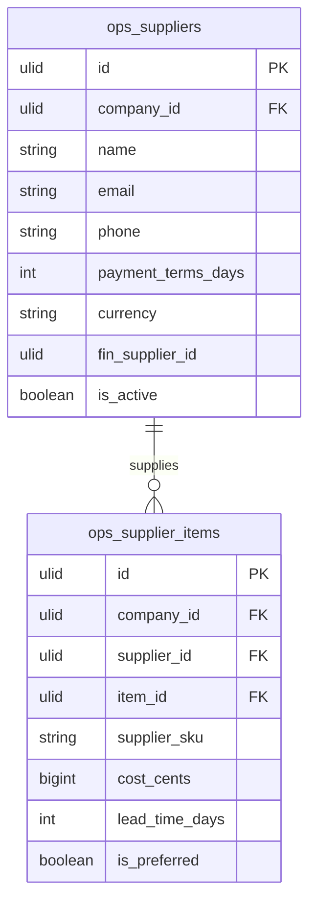

# Suppliers — Data Model

## ops_suppliers

| Column | Type | Constraints | Notes |
|---|---|---|---|
| id | ulid | PK | |
| company_id | ulid | not null, FK companies, indexed | BelongsToCompany |
| name | string | not null | |
| contact_name | string | nullable | |
| email | string | nullable | |
| phone | string | nullable | E.164 (propaganistas/laravel-phone) |
| address | jsonb | nullable | |
| payment_terms_days | int | not null, default 30 | |
| currency | string(3) | not null | ISO 4217 |
| fin_supplier_id | ulid | nullable | finance.ap link (reference only) |
| is_active | boolean | not null, default true | |
| deleted_at | timestamp | nullable | |

**Indexes:** `(company_id, name)`, `(company_id, is_active)`

---

## ops_supplier_items

| Column | Type | Constraints | Notes |
|---|---|---|---|
| id | ulid | PK | |
| company_id | ulid | not null, indexed | |
| supplier_id | ulid | not null, FK ops_suppliers | |
| item_id | ulid | not null, FK ops_items | |
| supplier_sku | string | nullable | vendor's own SKU |
| cost_cents | bigint | not null, min:0 | PO line cost default |
| lead_time_days | int | nullable | |
| is_preferred | boolean | not null, default false | one preferred per item |

**Indexes:** `(supplier_id, item_id)` unique; partial unique on `(company_id, item_id)` where `is_preferred = true` *(assumed enforcement)*.

---

## ERD

(`ops_items` owned by [[../inventory/_module|operations.inventory]]; `fin_supplier_id` references finance.ap's supplier — a reference, never a write.)
