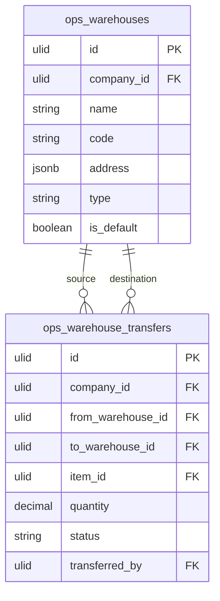

# Warehouses — Data Model

## ops_warehouses

| Column | Type | Constraints | Notes |
|---|---|---|---|
| id | ulid | PK | |
| company_id | ulid | not null, FK companies, indexed | BelongsToCompany |
| name | string | not null | |
| code | string | not null | unique `(company_id, code)` |
| address | jsonb | nullable | |
| type | string | not null | main / satellite / virtual |
| is_default | boolean | not null, default false | exactly one true per company |
| deleted_at | timestamp | nullable | blocked while stock > 0 *(assumed)* |

**Indexes:** `(company_id, code)` unique, partial unique on `(company_id)` where `is_default = true` *(assumed enforcement)*.

---

## ops_warehouse_transfers

| Column | Type | Constraints | Notes |
|---|---|---|---|
| id | ulid | PK | |
| company_id | ulid | not null, indexed | |
| from_warehouse_id | ulid | not null, FK ops_warehouses | ≠ to |
| to_warehouse_id | ulid | not null, FK ops_warehouses | ≠ from |
| item_id | ulid | not null, FK ops_items | read from inventory |
| quantity | decimal(12,2) | not null | > 0, ≤ available at source |
| status | string | not null, default `completed` | completed (v1 instant); in-transit later *(assumed)* |
| transferred_by | ulid | not null, FK users | |
| transferred_at | timestamp | not null | |

**Indexes:** `(company_id, from_warehouse_id)`, `(company_id, to_warehouse_id)`

---

## ERD

(`ops_items` + `ops_stock_levels` are owned by [[../inventory/_module|operations.inventory]]; a transfer references items and moves stock through `StockService`, never writing those tables directly.)
