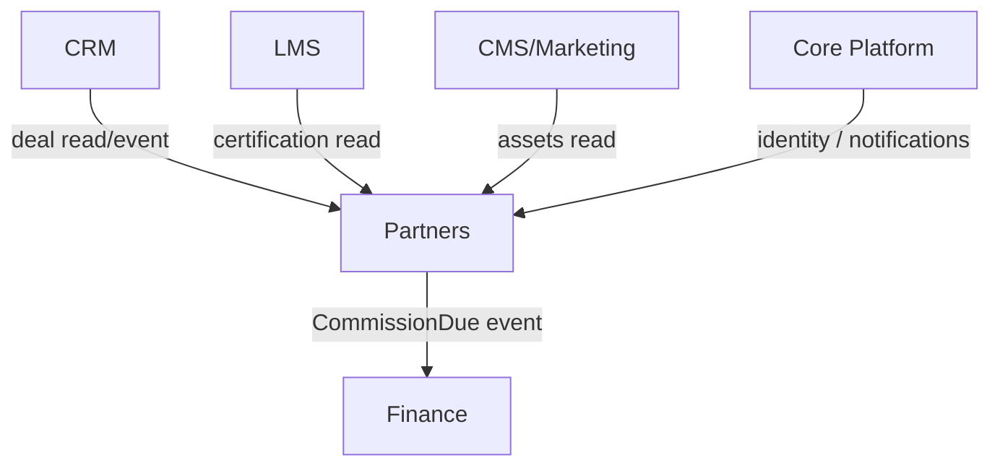

# Partner & Channel

Partner portal, deal registration, commission/payout management, onboarding, and co-marketing for
running a reseller / affiliate / channel programme. Replaces PartnerStack / Impartner / Crossbeam at the
SMB tier, wired into the suite's CRM deals and Finance payouts.

**Why deferred:** critical for SMB distribution at scale but premature before the product has traction
and an actual partner programme. Explode fully when the partner programme launches.

## Intended Modules *(assumed — no prior spec)*

| Module | Key | One-line purpose | UI kind guess |
|---|---|---|---|
| Partner Directory | partners.directory | Partner accounts, tiers, status, agreements | Filament resource |
| Partner Portal | partners.portal | External partner-facing self-serve portal | Vue/Inertia (portal) |
| Deal Registration | partners.deals | Partner-submitted deals, approval, conflict check | custom Filament page + resource |
| Commissions & Payouts | partners.commissions | Commission rules, accrual, payout runs | custom Filament page (reads Finance) |
| Onboarding & Enablement | partners.onboarding | Partner onboarding flows, cert, resources | Filament resource (reads LMS) |
| Co-Marketing / MDF | partners.marketing | Marketing assets, MDF requests, campaigns | Filament resource |
| Affiliate Tracking | partners.affiliate | Referral links, click/conversion attribution | custom Filament page + resource |
| Partner Tiers & Rules | partners.tiers | Tier definitions, benefits, thresholds | Filament resource (reference) |
| Dashboard | partners.dashboard | Programme performance overview | Filament dashboard + widgets |

## Cross-Domain Relations

| Direction | Counterpart domain | Coupling |
|---|---|---|
| consumes | CRM | read + event (deal ↔ registered deal) |
| feeds | Finance | event (commission payout due) |
| consumes | LMS | read (partner enablement / certification) |
| consumes | CMS/Marketing | read (co-marketing assets) |
| consumes | Core | read (identity, files, notifications) |

Full explosion into module/feature notes (with per-feature `## UI` + `## Relations`) happens when this
domain leaves `build-status: deferred`.
