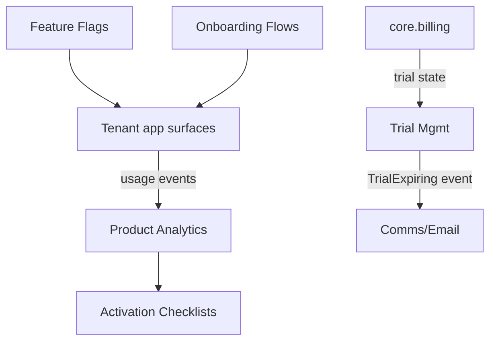

# Product-Led Growth

In-app growth tooling: feature flags, guided onboarding, activation checklists, in-app messaging, and trial-to-paid conversion. Lets a company drive product adoption from inside its own app surfaces rather than through sales.

**Why deferred:** originally scoped as internal tooling for FlowFlex's own growth experiments, not a customer-facing module. Revisit only when there is demand to expose PLG mechanics to tenant companies as a sellable module.

## Intended Modules *(assumed — no prior spec)*

| Module | Key | Purpose | UI kind guess |
|---|---|---|---|
| Feature Flags | `plg.flags` | Toggle/rollout features per company, cohort, or percentage | simple Filament resource |
| Onboarding Flows | `plg.onboarding` | Build multi-step guided tours / checklists shown in-app | custom Filament page (flow builder) |
| Activation Checklists | `plg.activation` | Track "aha-moment" milestones per user/account | Filament widget + resource |
| In-App Messaging | `plg.messaging` | Tooltips, banners, modals targeted by segment | custom Filament page |
| Trial Management | `plg.trials` | Trial lifecycle, expiry nudges, conversion prompts | simple Filament resource |
| Product Analytics | `plg.analytics` | Funnel, retention, feature-usage events | Filament widget (charts) |
| Experiments / A-B | `plg.experiments` | Variant assignment + outcome measurement | custom Filament page |

## Cross-Domain Relations *(assumed)*

| Direction | Counterpart | Coupling | Note |
|---|---|---|---|
| consumes | core.billing | read | trial/plan state drives conversion prompts |
| consumes | core.rbac / users | read | segment targeting by role/account |
| feeds | comms / email | event | `TrialExpiring` -> nurture email |
| consumes | (all domains) | event | feature-usage events feed analytics funnels |

## Sketch

Full explosion into module + feature folders happens when this domain leaves **deferred** status. See [[_opportunities]].
