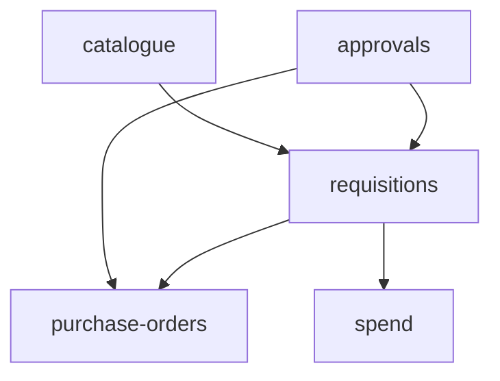

# Procurement

Purchase requisitions, sourcing POs, supplier catalogue, 3-way match, spend analytics, and approval workflows. **Panel:** `/operations` (hosted — see [[build/decisions/decision-2026-06-01-panel-consolidation]]) — Phase 3.

Procurement does NOT have its own panel. Its resources appear in the `/operations` panel under the **Procurement** nav group. Procurement layers on the Operations PO/GRN/supplier entities (hard deps — standalone fallbacks dropped in v2). Integrates with Finance AP for 3-way match (PO → GRN → bill).

---

## Navigation Groups (within /operations)

- **Requisitions** — Purchase Requisitions
- **Purchase Orders** — POs (procurement layer), Sourcing, 3-Way Match
- **Suppliers** — Supplier Catalogue, Supplier Status
- **Reporting** — Spend Analytics
- **Settings** — Approval Rules, Delegations

---

## Modules

| Module | Key | Status | Priority | Depends on (intra-domain) |
|---|---|---|---|---|
| [[domains/procurement/approvals\|Procurement Approvals]] | `procurement.approvals` | planned | p3 | — (build first) |
| [[domains/procurement/requisitions\|Purchase Requisitions]] | `procurement.requisitions` | planned | p3 | approvals |
| [[domains/procurement/supplier-catalogue\|Supplier Catalogue]] | `procurement.catalogue` | planned | p3 | — |
| [[domains/procurement/purchase-orders\|Purchase Orders (layer)]] | `procurement.purchase-orders` | planned | p3 | requisitions, approvals |
| [[domains/procurement/goods-receipt\|3-Way Match]] | `procurement.goods-receipt` | planned | p3 | — (ops GRN + finance.ap) |
| [[domains/procurement/spend-analytics\|Spend Analytics]] | `procurement.spend` | planned | p3 | requisitions |

## Dependency Graph (intra-domain)



## Cross-Domain Edges

No events of its own. Hard cross-domain deps: operations.purchase-orders, operations.goods-receipt, finance.ap (3-way match gate hooks into `ApService::approveBill`). Budget checks via `BudgetService::remaining()`.

---

## Status Board (Dataview)

```dataview
TABLE module-key AS "Key", status AS "Status", priority AS "Priority"
FROM "domains/procurement"
WHERE type = "module"
SORT module-key ASC
```

---

## Key Patterns

- `spatie/laravel-model-states` — requisition status
- `ApprovalMatrix::chainFor(type, amount, category)` — single routing API for requisitions + POs
- Blacklisted suppliers blocked everywhere via `SupplierGate`
- All money integer cents (brick/money)
