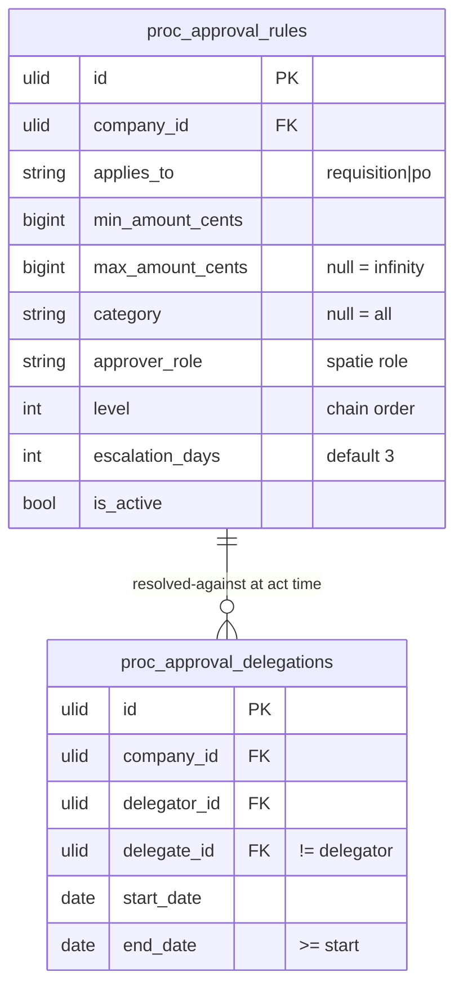

# Approvals — Data Model

Owns `proc_approval_rules`, `proc_approval_delegations`. No approval *action* rows here (those live in each consumer module — [[../../../security/data-ownership]]).

## ERD

## proc_approval_rules

| Column | Type | Notes |
|---|---|---|
| id, company_id (indexed) | ulid | |
| applies_to | string | requisition / po |
| min_amount_cents / max_amount_cents | bigint | max nullable = ∞; ranges must not overlap per (applies_to, category, level) |
| category | string nullable | null = all |
| approver_role | string | spatie role name (or user_id *(assumed: role-based v1)*) |
| level | int | chain order |
| escalation_days | int default 3 | |
| is_active | boolean | |

## proc_approval_delegations

id, company_id (indexed), delegator_id FK, delegate_id FK (≠ delegator), start_date/end_date (end ≥ start). Overlapping delegations per delegator rejected.

## Integrity rules

- Amount ranges may not overlap within the same `(applies_to, category, level)`.
- Every table row carries `company_id`; all queries run under CompanyScope.

## Related

- [[_module]] · [[architecture]] · [[api]] · [[../../../security/data-ownership]]
