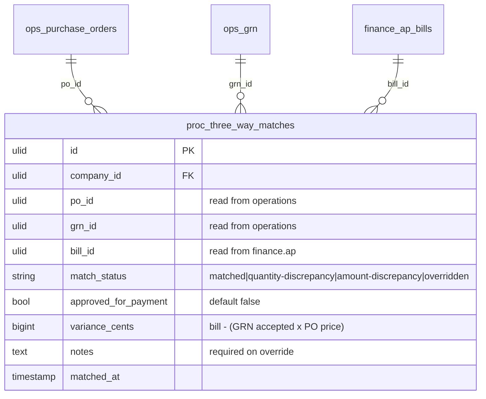

# 3-Way Match — Data Model

Owns `proc_three_way_matches`. Reads (never writes) `ops_purchase_orders`, `ops_grn*`, `finance_ap_bills`.

## ERD

## proc_three_way_matches

| Column | Type | Notes |
|---|---|---|
| id, company_id (indexed) | ulid | |
| po_id / grn_id / bill_id | ulid | **unique triple**; read-only refs to other domains |
| match_status | string | matched / quantity-discrepancy / amount-discrepancy / overridden |
| approved_for_payment | boolean default false | the gate flag |
| variance_cents | bigint | brick/money |
| notes | text nullable | required on override |
| matched_at | timestamp | |

## Integrity rules

- Unique `(company_id, po_id, grn_id, bill_id)`.
- `approved_for_payment` can only become true via auto-match (within tolerance) or an audited override.

## Related

- [[_module]] · [[architecture]] · [[api]] · [[../../../security/data-ownership]]
