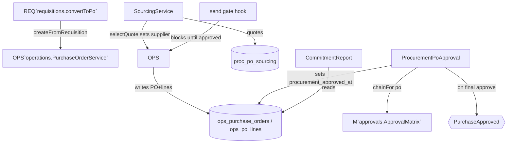

# Procurement PO Layer — Architecture

## Shape

A **layer over Operations POs**, not a second PO store. It adds three concerns as thin services and one owned table (`proc_po_sourcing`):

## Key decisions

- **Sourcing lives in `proc_po_sourcing`** (its own table); selecting a quote calls Operations' service to set the PO supplier — it does not write the PO row itself.
- **`procurement_approved_at`** is a column this module adds to `ops_purchase_orders` and owns writes to (via the approval + send-gate hook). Documented cross-boundary schema extension — see [[decisions]] + [[unknowns]].
- **Send gate** is registered as a hook on `PurchaseOrderService::send`: when procurement is active and the PO is procurement-linked, send is blocked until `procurement_approved_at` is set.
- **`PurchaseApproved`** is the outward event finance/operations react to — this module never writes their tables.
- **Money** integer cents (brick/money) throughout (quotes, commitments).

## Filament Artifacts

| Artifact | Kind ([[../../../architecture/ui-strategy]] row) | Blueprint / Tweaks | Notes |
|---|---|---|---|
| `ProcurementPoResource` | #1 CRUD resource (layer view) | badge-status, relation-panels | Procurement view over Operations POs: sourcing, approval state, commitment |
| `SourcingBoard` | #21 two-panel matcher custom page | side-by-side quotes | Collect/compare quotes, select winner (draft POs only) |

Hosted in **/operations** (Purchase Orders nav group). Every artifact gates on `canAccess() = Auth::user()->can('procurement.purchase-orders.view-any') && BillingService::hasModule('procurement.purchase-orders')` per [[../../../architecture/filament-patterns]] #1 -- the board states it explicitly.

## Concurrency

| Write path | Tier | Mechanism |
|---|---|---|
| Quote CRUD (`proc_po_sourcing`) | Optimistic | Version-checked save per [[../../../architecture/patterns/optimistic-locking]] |
| `selectQuote` (sets PO supplier) | Pessimistic | Sourcing rows + PO reference locked -- one winner per PO; delegates the supplier write to Operations' service |
| Final approval (`procurement_approved_at` + `PurchaseApproved`) | Pessimistic | Approval action locked -- stamp + event fire once; send gate reads the stamp |
| Commitment report | n-a | Read-only |

Tiers per [[../../../decisions/decision-2026-07-02-optimistic-locking-standard]].

## Related

- [[_module]] · [[data-model]] · [[api]] · [[../../operations/purchase-orders/_module]] · [[../../../architecture/event-bus]]
