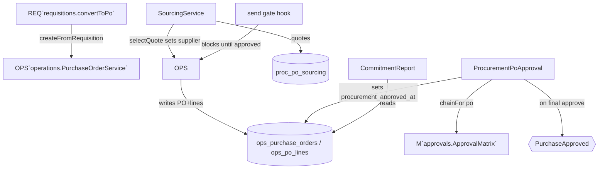

# Procurement PO Layer — Architecture

## Shape

A **layer over Operations POs**, not a second PO store. It adds three concerns as thin services and one owned table (`proc_po_sourcing`):

## Key decisions

- **Sourcing lives in `proc_po_sourcing`** (its own table); selecting a quote calls Operations' service to set the PO supplier — it does not write the PO row itself.
- **`procurement_approved_at`** is a column this module adds to `ops_purchase_orders` and owns writes to (via the approval + send-gate hook). Documented cross-boundary schema extension — see [[decisions]] + [[unknowns]].
- **Send gate** is registered as a hook on `PurchaseOrderService::send`: when procurement is active and the PO is procurement-linked, send is blocked until `procurement_approved_at` is set.
- **`PurchaseApproved`** is the outward event finance/operations react to — this module never writes their tables.
- **Money** integer cents (brick/money) throughout (quotes, commitments).

## Related

- [[_module]] · [[data-model]] · [[api]] · [[../../operations/purchase-orders/_module]] · [[../../../architecture/event-bus]]
