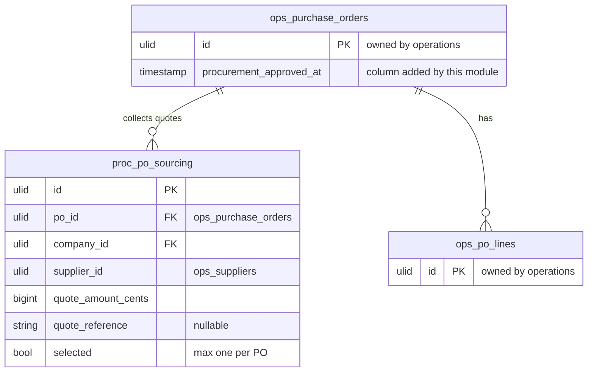

# Procurement PO Layer — Data Model

Owns `proc_po_sourcing`. Adds one column (`procurement_approved_at`) to the Operations-owned `ops_purchase_orders` — a documented schema extension ([[decisions]]).

## ERD

## proc_po_sourcing

| Column | Type | Notes |
|---|---|---|
| id, po_id FK, company_id (indexed) | ulid | |
| supplier_id | ulid FK ops_suppliers | not blacklisted (SupplierGate) |
| quote_amount_cents | bigint | brick/money |
| quote_reference | string nullable | |
| selected | boolean default false | **max one selected per PO** |

## Shared / read tables

- `ops_purchase_orders`, `ops_po_lines` — **owned by Operations**; read here for display + commitment math. Business writes go through Operations' service.
- `procurement_approved_at` on `ops_purchase_orders` — added + written by this module (approval/send-gate), read by the send path.

## Integrity rules

- At most one `selected = true` per `po_id`.
- Quote supplier must not be blacklisted at add + select time.

## Related

- [[_module]] · [[architecture]] · [[api]] · [[../../../security/data-ownership]] · [[decisions]]
