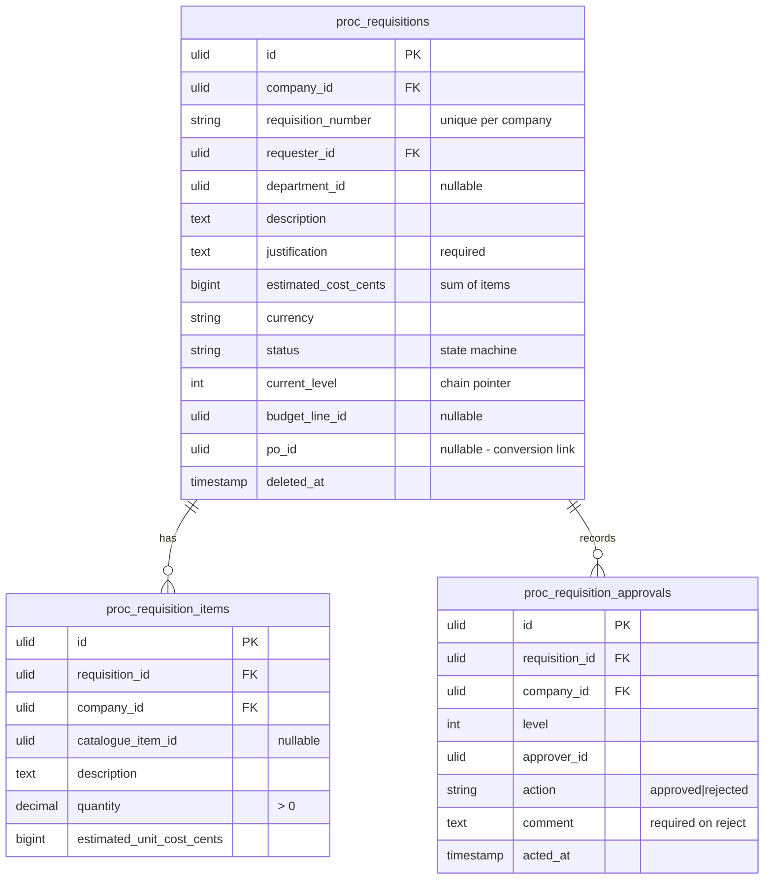

# Requisitions — Data Model

Owns `proc_requisitions`, `proc_requisition_items`, `proc_requisition_approvals`.

## ERD

## State machine

| State | → | Trigger | Side effects |
|---|---|---|---|
| `draft` | `submitted` | requester | chain resolved from matrix; level-1 approver notified |
| `submitted` | `approved` | final level approves | requester notified; fires `RequisitionApproved` |
| `submitted` | `rejected` | any level rejects | reason to requester; resubmit creates new chain |
| `approved` | `converted_to_po` | `procurement.requisitions.convert` | PO created via `PurchaseOrderService::createFromRequisition`; `po_id` set |

Approver ≠ requester. All transitions audited.

## proc_requisition_items
id, requisition_id FK, company_id, catalogue_item_id nullable, description, quantity decimal (> 0), estimated_unit_cost_cents.

## proc_requisition_approvals
id, requisition_id FK, company_id, level, approver_id, action (approved/rejected), comment nullable (required on reject), acted_at. This is the **only** place approval actions for requisitions are written (not in the approvals module).

## Related

- [[_module]] · [[architecture]] · [[api]] · [[../../../security/data-ownership]]
