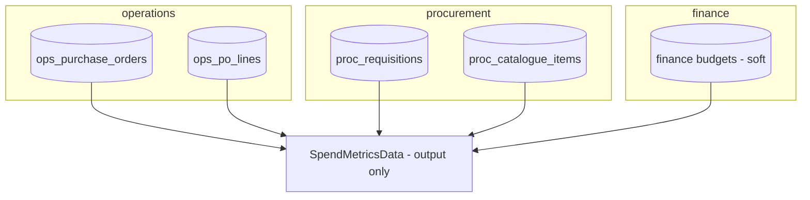

# Spend Analytics — Data Model

**Owns no tables.** This module is a pure read/aggregation surface — it never persists anything. It reads (read-only) from the tables owned by other modules and returns an output DTO.

## Read sources (owned elsewhere)

| Source table | Owner | Used for |
|---|---|---|
| `proc_requisitions` | procurement.requisitions | requested spend |
| `ops_purchase_orders`, `ops_po_lines` | operations.purchase-orders | committed/actual spend, supplier/category breakdown |
| `proc_catalogue_items` | procurement.catalogue (soft) | savings (agreed vs actual), maverick detection |
| finance budgets | finance.budgets (soft) | budget vs actual |

No migrations, no factories — see [[../../../security/data-ownership]] (a module with zero write tables cannot violate ownership).

## Related

- [[_module]] · [[architecture]] · [[api]]
