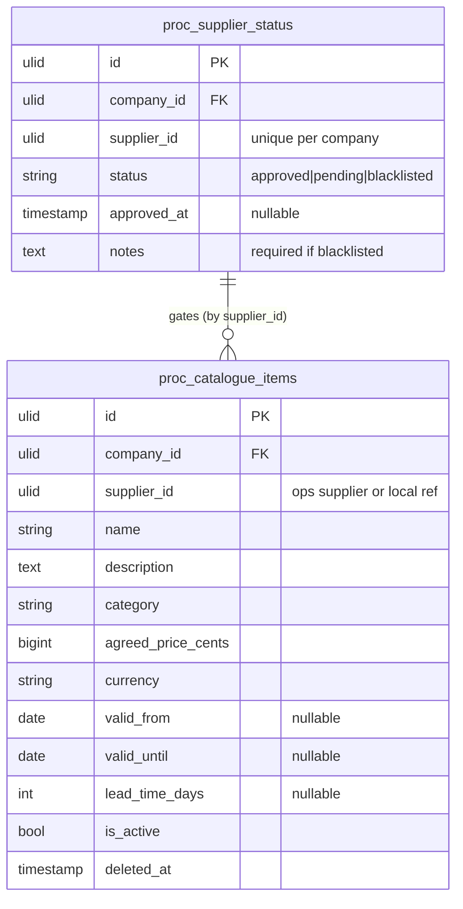

# Supplier Catalogue — Data Model

Owns `proc_catalogue_items`, `proc_supplier_status`.

## ERD

## proc_catalogue_items

| Column | Type | Notes |
|---|---|---|
| id, company_id (indexed) | ulid | |
| supplier_id | ulid | ops supplier or local ref |
| name / description | string / text | |
| category | string | |
| agreed_price_cents | bigint | brick/money |
| currency | string(3) | |
| valid_from / valid_until | date nullable | agreement window |
| lead_time_days | int nullable | |
| is_active | boolean | |
| deleted_at | timestamp nullable | |

## proc_supplier_status

id, company_id (indexed), supplier_id (unique per company), status (approved/pending/blacklisted), approved_at nullable, notes (required for blacklisted).

## Integrity rules

- One status row per `(company_id, supplier_id)`.
- `valid_until ≥ valid_from` when both set.
- Preferred supplier per category is a derived/flagged property *(assumed: `is_preferred` on the item or a small pivot — see [[unknowns]])*.

## Related

- [[_module]] · [[architecture]] · [[api]] · [[../../../security/data-ownership]]
