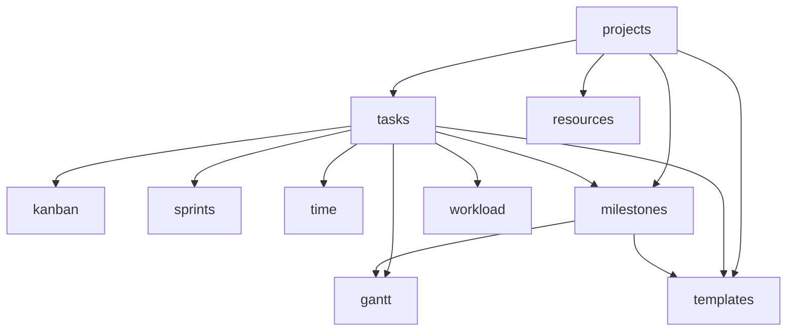

# Projects & Work

Task management, sprints, Kanban board, Gantt chart, OKRs, time tracking, and milestones. **Panel:** `/projects` (Indigo) — Phase 2 (M6 in [[build/ROADMAP]]).

**Displaces**: Asana, Monday.com, Jira

---

## Navigation Groups

- **Projects** — Projects, Kanban Board, Gantt Chart, Milestones, Workload
- **Tasks** — Tasks, My Tasks
- **Sprints** — Sprints, Sprint Board
- **Time** — Time Tracking, Timesheets
- **OKRs** — Objectives & Key Results
- **Settings** — Project Templates, Resource Allocation

---

## Modules

| Module | Key | Status | Priority | Depends on (intra-domain) |
|---|---|---|---|---|
| [[domains/projects/projects\|Projects]] | `projects.projects` | planned | p2 | — (anchor) |
| [[domains/projects/tasks\|Tasks]] | `projects.tasks` | planned | p2 | projects |
| [[domains/projects/kanban\|Kanban Board]] | `projects.kanban` | planned | p2 | tasks |
| [[domains/projects/sprints\|Sprints]] | `projects.sprints` | planned | p2 | tasks |
| [[domains/projects/time-tracking\|Time Tracking]] | `projects.time` | planned | p2 | tasks |
| [[domains/projects/milestones\|Milestones]] | `projects.milestones` | planned | p2 | projects, tasks |
| [[domains/projects/gantt\|Gantt Chart]] | `projects.gantt` | planned | p2 | tasks, milestones |
| [[domains/projects/okrs\|OKRs]] | `projects.okrs` | planned | p2 | — |
| [[domains/projects/templates\|Project Templates]] | `projects.templates` | planned | p2 | projects, tasks, milestones |
| [[domains/projects/workload\|Workload]] | `projects.workload` | planned | p2 | tasks |
| [[domains/projects/resource-allocation\|Resource Allocation]] | `projects.resources` | planned | p2 | projects |

Build order: projects → tasks → kanban → sprints → time → milestones → gantt → rest.

## Dependency Graph (intra-domain)



## Cross-Domain Edges

No domain events fired/consumed in v1 design. Cross-domain touchpoints are soft-deps: CRM client links on projects, billable-hours CSV export → Finance invoicing (manual v1), HR capacity for workload. Board/gantt live updates use broadcast-only events (not domain events).

---

## Status Board (Dataview)

```dataview
TABLE module-key AS "Key", status AS "Status", priority AS "Priority"
FROM "domains/projects"
WHERE type = "module"
SORT module-key ASC
```

---

## Key Patterns

- `spatie/laravel-model-states` — project status, task status, sprint status
- Custom Filament pages — Kanban (Reverb broadcast), Gantt, Sprint Board, Workload, Timesheet ([[architecture/ui-strategy]] rows #3/#5)
- `lorisleiva/laravel-actions` — `MoveTask`, `StartTimer`, `CompleteSprint`
- Time in minutes (int), money in cents — no float math
