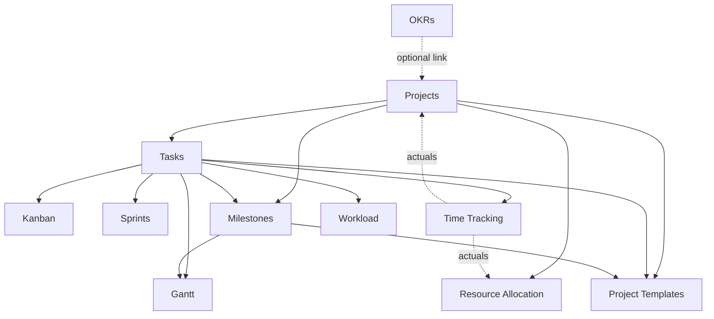

# Projects & Work — MOC

Task management, sprints, Kanban board, Gantt chart, OKRs, time tracking, milestones, workload, resource allocation, and templates. **Panel:** `/projects` (Indigo) — Phase 2.

**Displaces:** Asana, Monday.com, Jira, ClickUp. Gaps to exploit: [[_opportunities]].

Every module is exploded to a folder (`_module` + `architecture` + `data-model` + `api` + `security` + `decisions` + `unknowns` + `features/`). Convention: [[../../decisions/decision-2026-06-20-full-mapping-conventions]].

---

## Modules

| Module | Key | Owns tables | Features | Kind highlights |
|---|---|---|---|---|
| [[projects/_module\|Projects]] | `projects.projects` | `proj_projects`, `proj_project_members` | record, membership | resource + detail tabs, health widget |
| [[tasks/_module\|Tasks]] | `projects.tasks` | tasks, sections, dependencies, comments | task-crud, subtasks-deps, comments, my-tasks | resource + My Tasks page |
| [[kanban/_module\|Kanban Board]] | `projects.kanban` | — (view) | board-view | custom-page (drag + broadcast) |
| [[gantt/_module\|Gantt Chart]] | `projects.gantt` | — (view) | timeline-view | custom-page (frappe-gantt) |
| [[sprints/_module\|Sprints]] | `projects.sprints` | `proj_sprints`, `proj_sprint_tasks` | sprint-lifecycle, burndown-velocity | board page + burndown widget |
| [[milestones/_module\|Milestones]] | `projects.milestones` | `proj_milestones`, `proj_milestone_tasks` | tracking, reminders | resource + scheduled job |
| [[time-tracking/_module\|Time Tracking]] | `projects.time` | `proj_time_entries` | entry-timer, timesheet-approval, report-export | resource + timesheet/report pages |
| [[resource-allocation/_module\|Resource Allocation]] | `projects.resources` | `proj_resource_allocations` | allocation-record, capacity-timeline | resource + timeline page |
| [[workload/_module\|Workload]] | `projects.workload` | — (view) | workload-heatmap | custom-page heat-map |
| [[okrs/_module\|OKRs]] | `projects.okrs` | objectives, key-results, checkins | objectives-krs, checkins-dashboard | resource + dashboard + job |
| [[templates/_module\|Project Templates]] | `projects.templates` | 4× `proj_template_*` | authoring, instantiate | resource + wizard page |

**Build order:** projects → tasks → kanban → sprints → time → milestones → gantt → okrs → templates → workload → resources.

---

## Dependency Graph (intra-domain)



Pure-view modules (own no tables): **Kanban, Gantt, Workload** — they read `proj_tasks` and mutate only through the tasks module's actions ([[../../security/data-ownership]]).

---

## Cross-Domain Edges

```mermaid
graph LR
    tasks[projects.tasks] -->|@mention / assign| notif[core.notifications]
    tasks -->|attachments| files[core.file-storage]
    milestones[projects.milestones] -->|7-day reminder| notif
    okrs[projects.okrs] -->|check-in reminder| notif
    time[projects.time] -.billable CSV v1.-> inv[finance.invoicing]
    projects[projects.projects] -.client link read.-> crm[crm.contacts]
    workload[projects.workload] -.capacity read.-> hr[hr.employee-profiles]
```

- No **queued cross-domain domain events** fired in v1. Board/gantt/workload live sync uses **broadcast-only** `TaskMoved`.
- Cross-domain writes happen **only** through the owning module's service/action (notifications, files) or read APIs (CRM client, HR capacity). Billable hours → Finance is CSV export in v1 (automated integration = later ADR). See [[../../security/data-ownership]].

---

## Data ownership summary

Each module writes **only** its own `tables:`; view modules write nothing. Full rule + enforcement: [[../../security/data-ownership]].

---

## Key Patterns

- `spatie/laravel-model-states` — project, task, sprint status machines.
- Custom Filament pages — Kanban, Gantt, Sprint Board, Workload heat-map, Timesheet/Report, OKR dashboard, template wizard ([[../../architecture/ui-strategy]]).
- `lorisleiva/laravel-actions` — `MoveTask`, `StartTimer`, `CompleteSprint`, instantiation.
- Time in **minutes (int)**, money in **cents** — no float math.

## Related

- [[_opportunities|Opportunities]] · [[../_overview|Domains overview]]
- [[../../architecture/patterns/feature-ui-spec]] · [[../../_meta/feature-template]]
