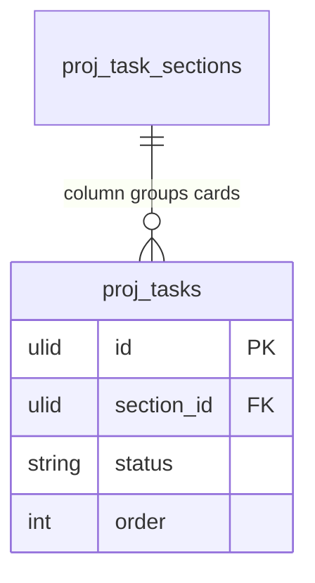

# Kanban — Data Model

**Owns no tables.** Kanban is a pure view over projects.tasks.

## Reads (owned elsewhere)

| Table | Owner | Used for |
|---|---|---|
| `proj_tasks` | projects.tasks | cards |
| `proj_task_sections` | projects.tasks | columns (section-group mode) |

## Read model (output DTO)

`BoardData` — `columns[]` (id, name, task_count) + `cards[]` (task summary: id, title, assignee, priority, due_date, labels[], subtask_count). Built from a single query in `KanbanService`.

## ERD

> No `proj_kanban_*` tables exist. Any board configuration (default group-by, saved filters) would be a future addition — see [[unknowns]].
