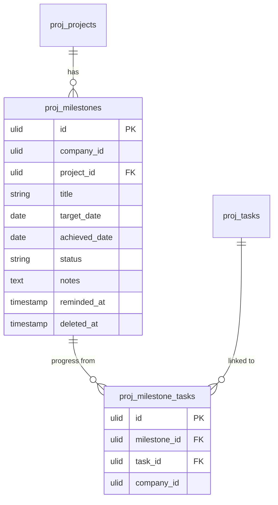

# Milestones — Data Model

## `proj_milestones`

| Column | Type | Notes |
|---|---|---|
| id, company_id (indexed), project_id FK | ulid | |
| title | string | |
| description | text | nullable |
| target_date | date | |
| achieved_date | date | nullable |
| status | string | default `open` — open / achieved / missed (plain enum *(assumed)*) |
| notes | text | nullable — achievement notes |
| reminded_at | timestamp | nullable — 7-day once-guard |
| deleted_at | timestamp | nullable |

**Indexes:** `(company_id, status, target_date)`.

## `proj_milestone_tasks`
`id, milestone_id FK, task_id FK, company_id`; unique `(milestone_id, task_id)`.

## ERD

