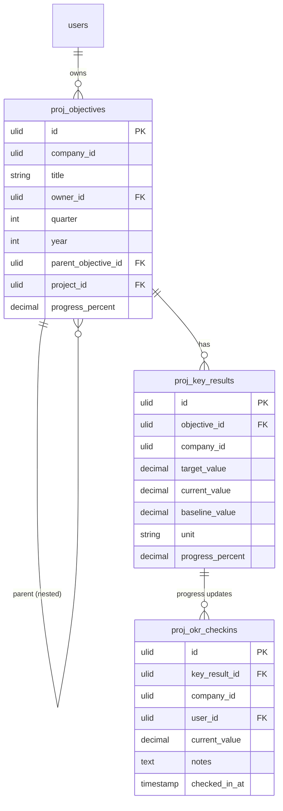

# OKRs — Data Model

## `proj_objectives`

| Column | Type | Notes |
|---|---|---|
| id, company_id (indexed) | ulid | |
| title | string | |
| description | text | nullable |
| owner_id | ulid FK users | |
| quarter | int 1–4 | |
| year | int | |
| parent_objective_id | ulid nullable FK self | cycle-checked, depth ≤ 4 *(assumed)* |
| project_id | ulid nullable FK | optional project link *(assumed)* |
| progress_percent | decimal(5,2) default 0 | computed cache |
| deleted_at | timestamp nullable | |

## `proj_key_results`

| Column | Type | Notes |
|---|---|---|
| id, objective_id FK, company_id | ulid | |
| title | string | |
| target_value / current_value | decimal(14,2) | |
| baseline_value | decimal(14,2) default 0 | start-value support |
| unit | string | %, €, count… |
| progress_percent | decimal(5,2) default 0 | |

## `proj_okr_checkins`
`id, key_result_id FK, company_id, user_id FK, current_value, notes, checked_in_at`.

## ERD

