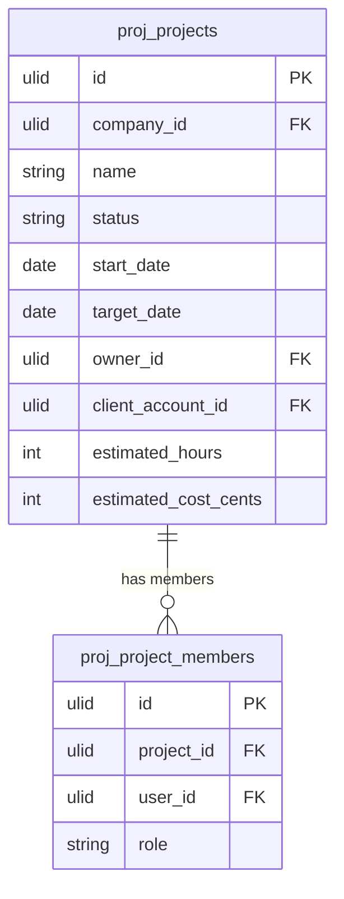

# Projects

Project records with goals, ownership, status, team members, and budget tracking. The top-level container for all work.

## Core Features

- Project record: name, description, status, start date, target date, owner, team members
- Project status machine: `planning → active → on_hold → completed | cancelled` (spatie/laravel-model-states)
- Project categories/tags for grouping (spatie/laravel-tags)
- Budget: estimated hours, estimated cost, actual vs estimate tracking
- Project health indicators: on-track, at-risk, off-track based on progress vs timeline
- Client association: link project to a CRM account or contact
- Project dashboard: overview of active projects, completion rate, health summary
- Archive completed projects

## Data Model

| Table | Key Columns |
|---|---|
| `proj_projects` | company_id, name, description, status, start_date, target_date, completed_at, owner_id, client_account_id, estimated_hours, estimated_cost_cents, color |
| `proj_project_members` | project_id, company_id, user_id, role (owner/member/viewer) |

## Filament

**Nav group:** Projects

- `ProjectResource` — list, create, edit, view
- View page tabs: Overview, Tasks, Sprints, Milestones, Files, Time Entries
- `ProjectStatsWidget` — active projects count, on-track vs at-risk pie

## Related

- [[domains/projects/tasks]]
- [[domains/projects/sprints]]
- [[domains/crm/contacts]]
