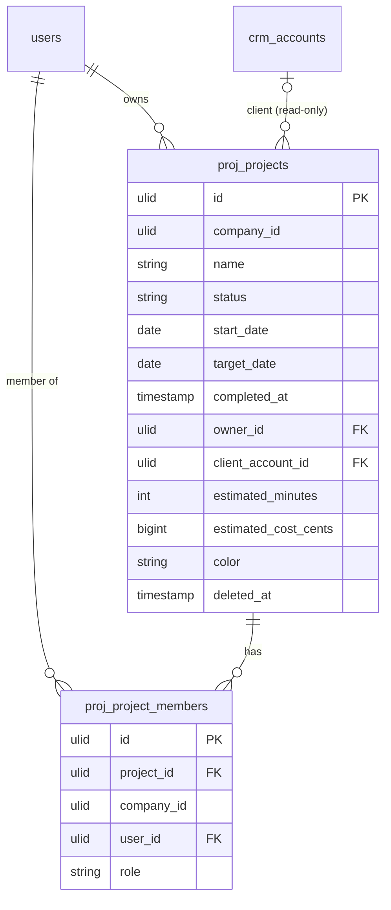

# Projects — Data Model

## `proj_projects`

| Column | Type | Constraints | Notes |
|---|---|---|---|
| id, company_id (indexed) | ulid | | `BelongsToCompany` |
| name | string | not null | |
| description | text | nullable | |
| status | string | default `planning` | state machine |
| start_date / target_date | date | target ≥ start | |
| completed_at | timestamp | nullable | |
| owner_id | ulid | not null FK users | |
| client_account_id | ulid | nullable | CRM link (read-only resolve) |
| estimated_minutes | int | nullable | |
| estimated_cost_cents | bigint | nullable | minor currency unit |
| color | string(7) | default per palette *(assumed)* | board/gantt display |
| deleted_at | timestamp | nullable | SoftDeletes |

**Indexes:** `(company_id, status)`, `(company_id, owner_id)`.

## `proj_project_members`

| Column | Type | Notes |
|---|---|---|
| id, project_id FK, company_id, user_id FK | ulid | unique `(project_id, user_id)` |
| role | string | owner / member / viewer |

## ERD

