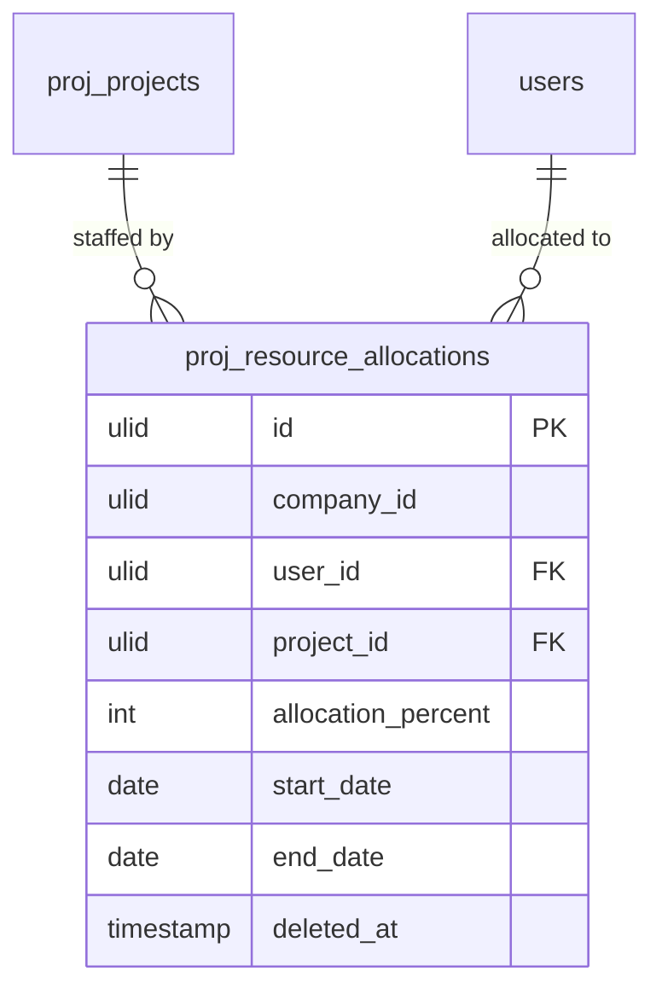

# Resource Allocation — Data Model

## `proj_resource_allocations`

| Column | Type | Constraints | Notes |
|---|---|---|---|
| id, company_id (indexed) | ulid | | |
| user_id | ulid | not null FK | |
| project_id | ulid | not null FK | |
| allocation_percent | int | 1–100 | |
| start_date / end_date | date | end ≥ start | |
| deleted_at | timestamp | nullable | SoftDeletes |

**Indexes:** `(company_id, user_id, start_date, end_date)`.

## ERD

