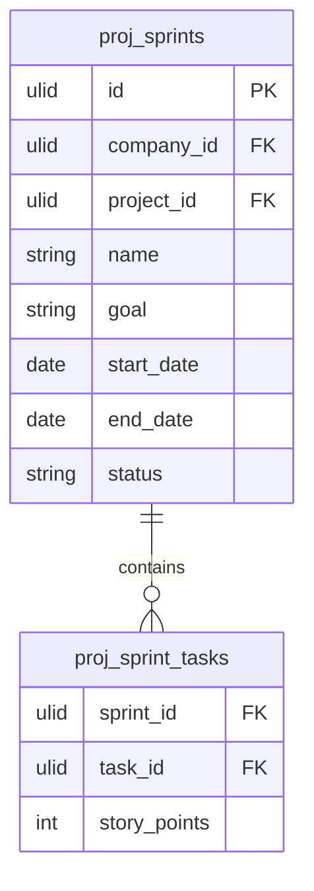

# Sprints

Sprint planning, backlog management, velocity tracking, and sprint retrospective notes for teams using Scrum or iteration-based workflows.

## Core Features

- Sprint record: name, start date, end date, goal, project
- Sprint status machine: `planning → active → completed`
- Backlog: task pool not yet assigned to a sprint
- Sprint planning: drag tasks from backlog into sprint
- Sprint board: Kanban view filtered to current sprint tasks
- Burndown chart: remaining story points / hours over sprint days
- Velocity tracking: completed points per sprint, rolling average
- Sprint retrospective notes (what went well, what to improve, action items)
- Only one active sprint per project at a time

## Data Model

| Table | Key Columns |
|---|---|
| `proj_sprints` | company_id, project_id, name, goal, start_date, end_date, status |
| `proj_sprint_tasks` | sprint_id, task_id, company_id, story_points |

## Filament

**Nav group:** Sprints

- `SprintResource` — list, create, edit, complete sprint
- `SprintBoardPage` (custom page) — Kanban filtered to active sprint + backlog sidebar
- `BurndownChartWidget` — line chart (leandrocfe/filament-apex-charts) on sprint view page

## Related

- [[domains/projects/tasks]]
- [[domains/projects/kanban]]
