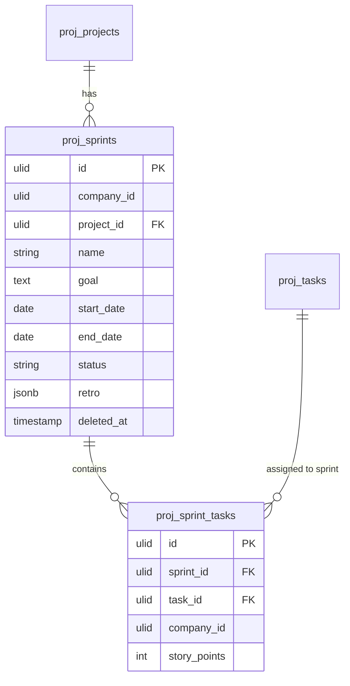

# Sprints — Data Model

## `proj_sprints`

| Column | Type | Constraints | Notes |
|---|---|---|---|
| id, company_id (indexed), project_id FK | ulid | | |
| name | string | not null | |
| goal | text | nullable | |
| start_date / end_date | date | end after start | |
| status | string | default `planning` | state machine |
| retro | jsonb | nullable | {went_well, improve, actions[]} |
| deleted_at | timestamp | nullable | SoftDeletes |

**Indexes:** `(company_id, project_id, status)` — one active enforced in service.

## `proj_sprint_tasks`

| Column | Type | Notes |
|---|---|---|
| id, sprint_id FK, task_id FK, company_id | ulid | unique `(sprint_id, task_id)`; task in one active sprint max |
| story_points | int nullable | |

## ERD

