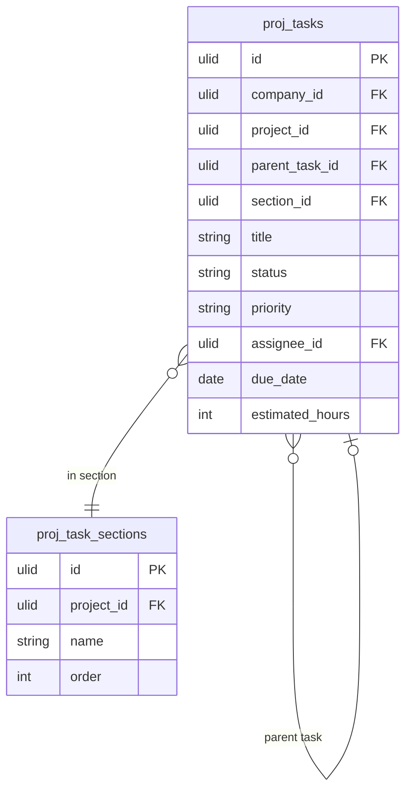

# Tasks

Task management within projects: create, assign, prioritise, track status, sub-tasks, dependencies, and comments. Core unit of work in the Projects domain.

## Core Features

- Task record: title, description, status, priority, assignee, due date, estimated hours, project, section
- Task status machine: `todo → in_progress → in_review → done | cancelled`
- Sub-tasks: unlimited nesting (parent_task_id self-referential FK)
- Task dependencies: blocks / blocked-by relationships
- Task sections/groups within a project (columns in Kanban, swimlanes)
- Priority levels: urgent, high, medium, low
- Labels/tags via spatie/laravel-tags
- Comments on tasks: threaded discussion
- Attachments via Media Library
- Time logging: log hours against a task
- @mention notifications to assignee/commenter

## Data Model

| Table | Key Columns |
|---|---|
| `proj_tasks` | company_id, project_id, parent_task_id, section_id, title, description, status, priority, assignee_id, due_date, estimated_hours, order |
| `proj_task_sections` | company_id, project_id, name, order |
| `proj_task_dependencies` | company_id, task_id, depends_on_task_id, type (blocks/related) |
| `proj_task_comments` | company_id, task_id, user_id, body, parent_comment_id |

## Filament

**Nav group:** Tasks

- `TaskResource` — list (filter by project/assignee/status/priority), create, edit, view
- View page: task detail with comments thread + time log + sub-tasks list
- `MyTasksPage` (custom page) — tasks assigned to current user across all projects, grouped by due date

## Related

- [[domains/projects/projects]]
- [[domains/projects/kanban]]
- [[domains/projects/sprints]]
- [[domains/projects/time-tracking]]
