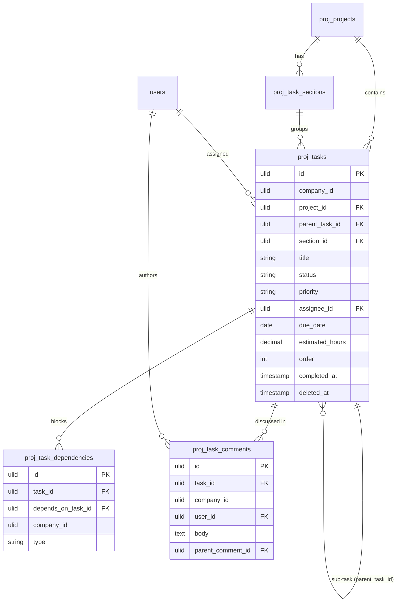

# Tasks — Data Model

## `proj_tasks`

| Column | Type | Constraints | Notes |
|---|---|---|---|
| id, company_id (indexed), project_id FK | ulid | | |
| parent_task_id | ulid | nullable FK self | sub-tasks (unlimited nesting) |
| section_id | ulid | nullable FK | |
| title | string | not null | |
| description | text | nullable | |
| status | string | default `todo` | state machine |
| priority | string | default `medium` | urgent/high/medium/low |
| assignee_id | ulid | nullable FK users | project member |
| due_date | date | nullable | |
| estimated_hours | decimal(6,2) | nullable | |
| order | int | default 0 | board/section order |
| completed_at | timestamp | nullable | *(assumed)* |
| deleted_at | timestamp | nullable | SoftDeletes |

**Indexes:** `(company_id, project_id, status)`, `(company_id, assignee_id, status, due_date)` (My Tasks / workload).

## `proj_task_sections`
`id, project_id FK, company_id, name, order`.

## `proj_task_dependencies`
`id, task_id FK, depends_on_task_id FK, company_id, type (blocks/related)`; unique `(task_id, depends_on_task_id)`; cycle-checked in service.

## `proj_task_comments`
`id, task_id FK, company_id, user_id FK, body (purified), parent_comment_id nullable, deleted_at`.

## ERD

