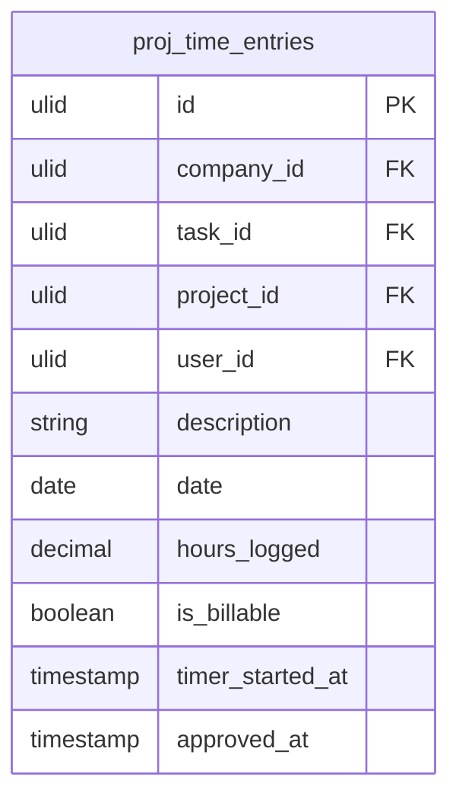

# Time Tracking

Log time against tasks and projects. Manual entry or timer-based. Feeds into project cost reporting and billable hours for invoicing.

## Core Features

- Time entry: task, project, description, date, hours logged (manual) or start/stop timer
- Timer: start/stop timer on any task from task view or Kanban card
- Weekly timesheet view: all entries for the week, per-user total
- Time approval: manager reviews and approves team timesheets
- Billable flag: mark time entries as billable or non-billable
- Project time report: total logged vs estimated per task, per assignee
- Export time entries to CSV for client billing or payroll
- Integration with Finance invoicing: billable hours feed into invoice line items

## Data Model

| Table | Key Columns |
|---|---|
| `proj_time_entries` | company_id, task_id, project_id, user_id, description, date, hours_logged, is_billable, timer_started_at, approved_by, approved_at |

## Filament

**Nav group:** Time

- `TimeEntryResource` — list (filter by project/user/date/billable), create, edit, approve action
- `TimesheetPage` (custom page) — weekly grid: users × days with hour totals
- `ProjectTimeReportPage` (custom page) — per-project time vs estimate breakdown

## Related

- [[domains/projects/tasks]]
- [[domains/projects/projects]]
- [[domains/finance/invoicing]]
