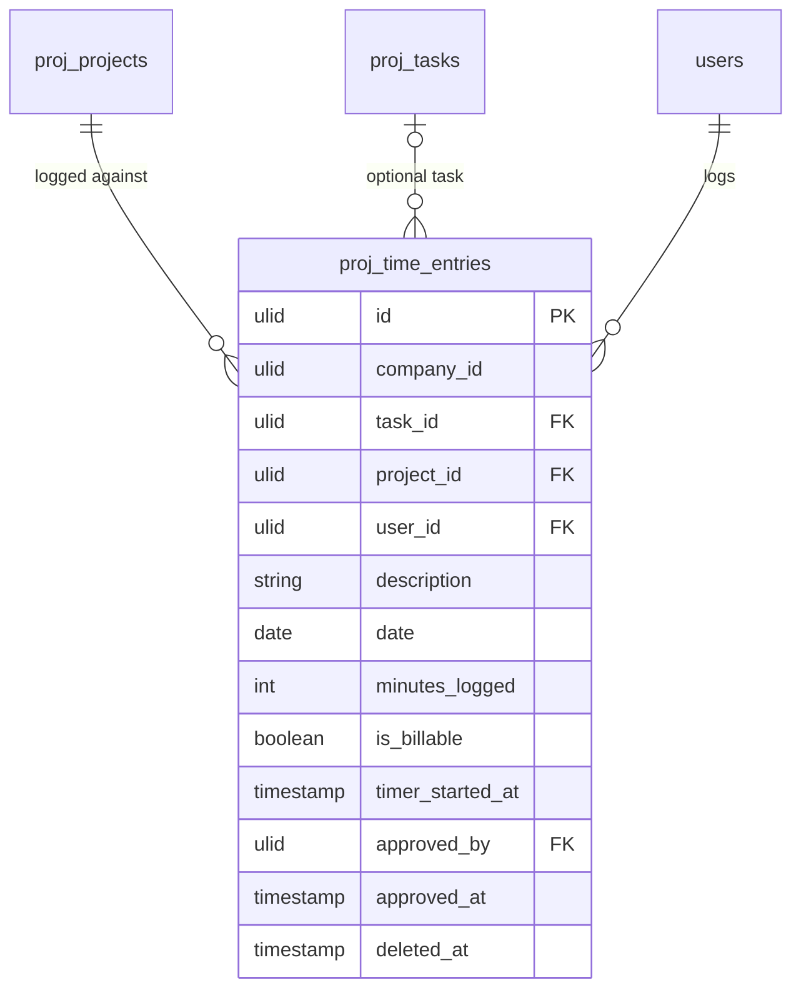

# Time Tracking — Data Model

## `proj_time_entries`

| Column | Type | Constraints | Notes |
|---|---|---|---|
| id, company_id (indexed) | ulid | | |
| task_id | ulid | nullable FK | project-level entries allowed *(assumed)* |
| project_id | ulid | not null FK | |
| user_id | ulid | not null FK | |
| description | string | nullable | |
| date | date | not null, not future | |
| minutes_logged | int | > 0 | **minutes int, not decimal hours** |
| is_billable | boolean | default false | |
| timer_started_at | timestamp | nullable | running-timer marker |
| approved_by / approved_at | ulid / timestamp | nullable | |
| deleted_at | timestamp | nullable | SoftDeletes |

**Indexes:** `(company_id, user_id, date)`, `(company_id, project_id, date)`; partial: one row per user where `timer_started_at` not null *(assumed — enforced in service)*.

## ERD

